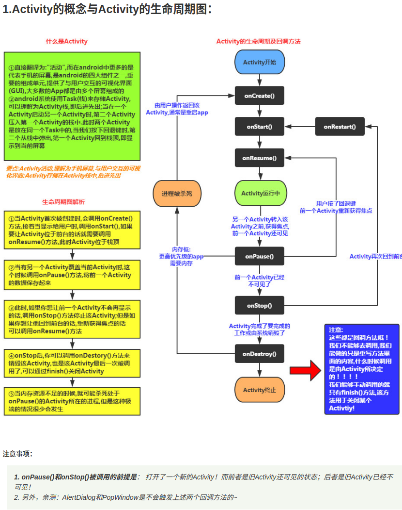
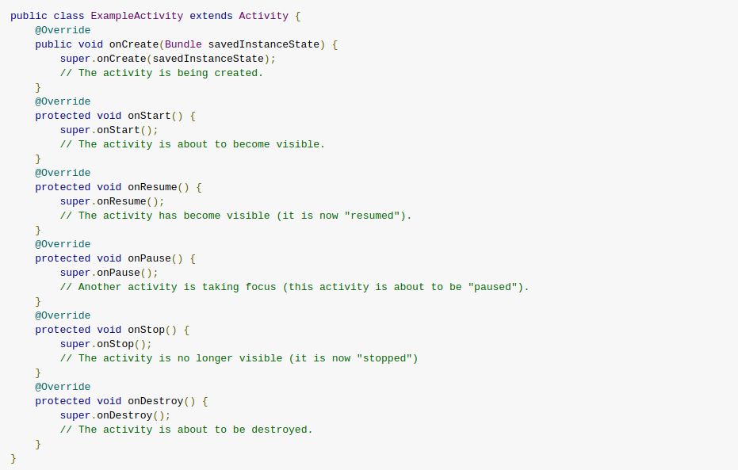
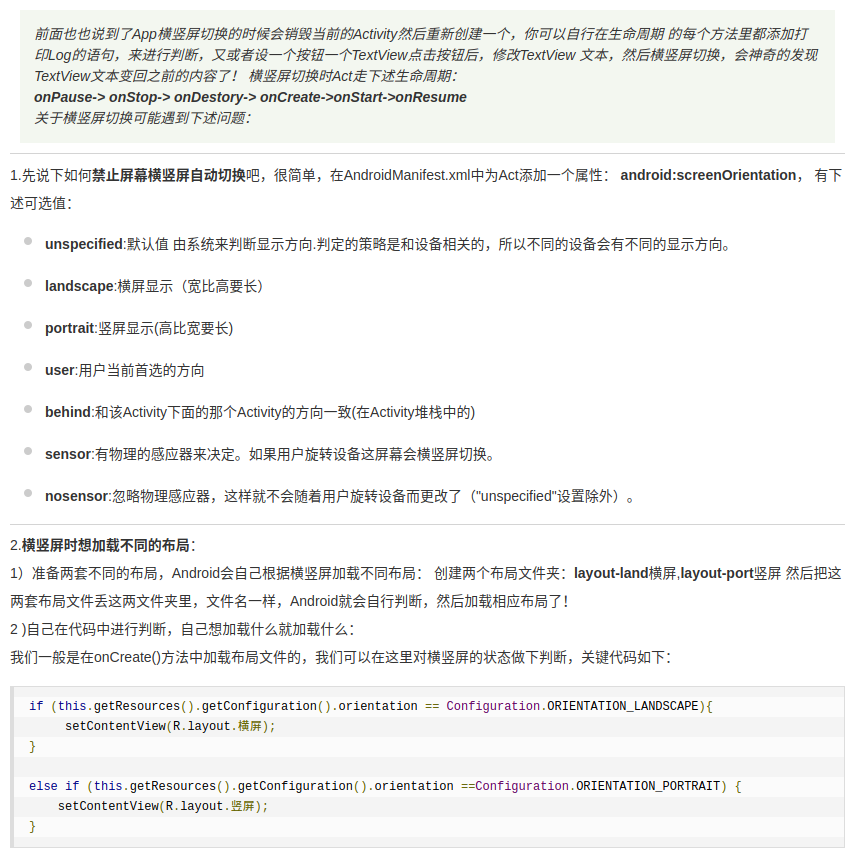
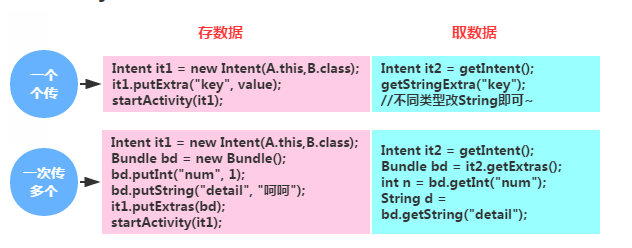

#Activity学习
##1.Activity的概念及生命周期

下图来自官网的说明：



##2.启动另一个Ａctivity的方式
.显示启动：
```java
//显式启动的方式
        Intent intent=new Intent(MainActivity.this,SecondActivity.class);
        MainActivity.this.startActivity(intent);
```
.隐式启动:
AndroidManifest.xml
```xml
 <activity android:name=".SecondActivity"
           android:label="第二个界面">
        <intent-filter>
            <action android:name="second_action" />
            <category android:name="second_category" />
            <category android:name="android.intent.category.DEFAULT" />
        </intent-filter>
</activity>
```

java代码:
```java
                //隐式启动
                Intent intent=new Intent();
                intent.setAction("second_action");
                intent.addCategory("second_category");
                startActivity(intent);
```

###3.横竖屏切换的问题

###4.系统常见的Activity(很有用)
```java
//1.拨打电话
// 给移动客服10086拨打电话
Uri uri = Uri.parse("tel:10086");
Intent intent = new Intent(Intent.ACTION_DIAL, uri);
startActivity(intent);

//2.发送短信
// 给10086发送内容为“Hello”的短信
Uri uri = Uri.parse("smsto:10086");
Intent intent = new Intent(Intent.ACTION_SENDTO, uri);
intent.putExtra("sms_body", "Hello");
startActivity(intent);

//3.发送彩信（相当于发送带附件的短信）
Intent intent = new Intent(Intent.ACTION_SEND);
intent.putExtra("sms_body", "Hello");
Uri uri = Uri.parse("content://media/external/images/media/23");
intent.putExtra(Intent.EXTRA_STREAM, uri);
intent.setType("image/png");
startActivity(intent);

//4.打开浏览器:
// 打开Google主页
Uri uri = Uri.parse("http://www.baidu.com");
Intent intent  = new Intent(Intent.ACTION_VIEW, uri);
startActivity(intent);

//5.发送电子邮件:(阉割了Google服务的没戏!!!!)
// 给someone@domain.com发邮件
Uri uri = Uri.parse("mailto:someone@domain.com");
Intent intent = new Intent(Intent.ACTION_SENDTO, uri);
startActivity(intent);
// 给someone@domain.com发邮件发送内容为“Hello”的邮件
Intent intent = new Intent(Intent.ACTION_SEND);
intent.putExtra(Intent.EXTRA_EMAIL, "someone@domain.com");
intent.putExtra(Intent.EXTRA_SUBJECT, "Subject");
intent.putExtra(Intent.EXTRA_TEXT, "Hello");
intent.setType("text/plain");
startActivity(intent);
// 给多人发邮件
Intent intent=new Intent(Intent.ACTION_SEND);
String[] tos = {"1@abc.com", "2@abc.com"}; // 收件人
String[] ccs = {"3@abc.com", "4@abc.com"}; // 抄送
String[] bccs = {"5@abc.com", "6@abc.com"}; // 密送
intent.putExtra(Intent.EXTRA_EMAIL, tos);
intent.putExtra(Intent.EXTRA_CC, ccs);
intent.putExtra(Intent.EXTRA_BCC, bccs);
intent.putExtra(Intent.EXTRA_SUBJECT, "Subject");
intent.putExtra(Intent.EXTRA_TEXT, "Hello");
intent.setType("message/rfc822");
startActivity(intent);

//6.显示地图:
// 打开Google地图中国北京位置（北纬39.9，东经116.3）
Uri uri = Uri.parse("geo:39.9,116.3");
Intent intent = new Intent(Intent.ACTION_VIEW, uri);
startActivity(intent);

//7.路径规划
// 路径规划：从北京某地（北纬39.9，东经116.3）到上海某地（北纬31.2，东经121.4）
Uri uri = Uri.parse("http://maps.google.com/maps?f=d&saddr=39.9 116.3&daddr=31.2 121.4");
Intent intent = new Intent(Intent.ACTION_VIEW, uri);
startActivity(intent);

//8.多媒体播放:
Intent intent = new Intent(Intent.ACTION_VIEW);
Uri uri = Uri.parse("file:///sdcard/foo.mp3");
intent.setDataAndType(uri, "audio/mp3");
startActivity(intent);

//获取SD卡下所有音频文件,然后播放第一首=-= 
Uri uri = Uri.withAppendedPath(MediaStore.Audio.Media.INTERNAL_CONTENT_URI, "1");
Intent intent = new Intent(Intent.ACTION_VIEW, uri);
startActivity(intent);

//9.打开摄像头拍照:
// 打开拍照程序
Intent intent = new Intent(MediaStore.ACTION_IMAGE_CAPTURE); 
startActivityForResult(intent, 0);
// 取出照片数据
Bundle extras = intent.getExtras(); 
Bitmap bitmap = (Bitmap) extras.get("data");

//另一种:
//调用系统相机应用程序，并存储拍下来的照片
Intent intent = new Intent(MediaStore.ACTION_IMAGE_CAPTURE); 
time = Calendar.getInstance().getTimeInMillis();
intent.putExtra(MediaStore.EXTRA_OUTPUT, Uri.fromFile(new File(Environment
.getExternalStorageDirectory().getAbsolutePath()+"/tucue", time + ".jpg")));
startActivityForResult(intent, ACTIVITY_GET_CAMERA_IMAGE);

//10.获取并剪切图片
// 获取并剪切图片
Intent intent = new Intent(Intent.ACTION_GET_CONTENT);
intent.setType("image/*");
intent.putExtra("crop", "true"); // 开启剪切
intent.putExtra("aspectX", 1); // 剪切的宽高比为1：2
intent.putExtra("aspectY", 2);
intent.putExtra("outputX", 20); // 保存图片的宽和高
intent.putExtra("outputY", 40); 
intent.putExtra("output", Uri.fromFile(new File("/mnt/sdcard/temp"))); // 保存路径
intent.putExtra("outputFormat", "JPEG");// 返回格式
startActivityForResult(intent, 0);
// 剪切特定图片
Intent intent = new Intent("com.android.camera.action.CROP"); 
intent.setClassName("com.android.camera", "com.android.camera.CropImage"); 
intent.setData(Uri.fromFile(new File("/mnt/sdcard/temp"))); 
intent.putExtra("outputX", 1); // 剪切的宽高比为1：2
intent.putExtra("outputY", 2);
intent.putExtra("aspectX", 20); // 保存图片的宽和高
intent.putExtra("aspectY", 40);
intent.putExtra("scale", true);
intent.putExtra("noFaceDetection", true); 
intent.putExtra("output", Uri.parse("file:///mnt/sdcard/temp")); 
startActivityForResult(intent, 0);

//11.打开Google Market 
// 打开Google Market直接进入该程序的详细页面
Uri uri = Uri.parse("market://details?id=" + "com.demo.app");
Intent intent = new Intent(Intent.ACTION_VIEW, uri);
startActivity(intent);

//12.进入手机设置界面:
// 进入无线网络设置界面（其它可以举一反三）  
Intent intent = new Intent(android.provider.Settings.ACTION_WIRELESS_SETTINGS);  
startActivityForResult(intent, 0);

//13.安装apk:
Uri installUri = Uri.fromParts("package", "xxx", null);   
returnIt = new Intent(Intent.ACTION_PACKAGE_ADDED, installUri);

//14.卸载apk:
Uri uri = Uri.fromParts("package", strPackageName, null);      
Intent it = new Intent(Intent.ACTION_DELETE, uri);      
startActivity(it); 

//15.发送附件:
Intent it = new Intent(Intent.ACTION_SEND);      
it.putExtra(Intent.EXTRA_SUBJECT, "The email subject text");      
it.putExtra(Intent.EXTRA_STREAM, "file:///sdcard/eoe.mp3");      
sendIntent.setType("audio/mp3");      
startActivity(Intent.createChooser(it, "Choose Email Client"));

//16.进入联系人页面:
Intent intent = new Intent();
intent.setAction(Intent.ACTION_VIEW);
intent.setData(People.CONTENT_URI);
startActivity(intent);

//17.查看指定联系人:
Uri personUri = ContentUris.withAppendedId(People.CONTENT_URI, info.id);//info.id联系人ID
Intent intent = new Intent();
intent.setAction(Intent.ACTION_VIEW);
intent.setData(personUri);
startActivity(intent);
```

###5.Activity间传递数据

###6.多个Activity间的交互(后一个传回给前一个)

###7.知晓当前是哪个Activity
一般用于BaseActivity中，所有的Activity只需要继承此类即可
```java
String currentActivityName=getClass.getSimpleName();
```
###8.如何结束所有的Activity
创建一个BaseActivity.java
```java 
import android.os.Bundle;
import android.support.annotation.Nullable;
import android.support.v7.app.AppCompatActivity;

public class BaseActivity extends AppCompatActivity {

    @Override
    protected void onCreate(@Nullable Bundle savedInstanceState) {
        super.onCreate(savedInstanceState);
        ActivityCllection.addActivity(this);
    }

    @Override
    protected void onDestroy() {
        super.onDestroy();
        ActivityCllection.remoceActivity(this);
    }    
}
```

创建一个ActivityCollection.java
```java
import android.app.Activity;
import java.util.ArrayList;

public class ActivityCllection {

    public static ArrayList<Activity> activities=new ArrayList<>();

    public static void addActivity(Activity activity){
        activities.add(activity);
    }

    public static void remoceActivity(Activity activity){
        activities.remove(activity);
    }

    public static void finishAll(){
        for (Activity activity:activities){
            if (!activity.isFinishing()){
                activity.finish();
            }
        }
    }
}
```
###9.完全退出App的方法
```java
/** 
 * 退出应用程序 
 */  
public void AppExit(Context context) {  
    try {  
        ActivityCollector.finishAll();  
        ActivityManager activityMgr = (ActivityManager) context  
                .getSystemService(Context.ACTIVITY_SERVICE);  
        activityMgr.killBackgroundProcesses(context.getPackageName());  
        System.exit(0);  
    } catch (Exception ignored) {}  
}  
```
###10.双击退出程序
```java
// 定义一个变量，来标识是否退出
private static boolean isExit = false;
Handler mHandler = new Handler() {
    @Override
    public void handleMessage(Message msg) {
        super.handleMessage(msg);
        isExit = false;
    }
};

public boolean onKeyDown(int keyCode, KeyEvent event) {
    if (keyCode == KeyEvent.KEYCODE_BACK) {
        if (!isExit) {
            isExit = true;
            Toast.makeText(getApplicationContext(), "再按一次退出程序",
                    Toast.LENGTH_SHORT).show();
            // 利用handler延迟发送更改状态信息
            mHandler.sendEmptyMessageDelayed(0, 2000);
        } else {
            exit(this);
        }
        return false;
    }
return super.onKeyDown(keyCode, event);}
```

或者
```java
//保存点击的时间
private long exitTime = 0;
public boolean onKeyDown(int keyCode, KeyEvent event) {
    if (keyCode == KeyEvent.KEYCODE_BACK) {
        if ((System.currentTimeMillis() - exitTime) > 2000) {
            Toast.makeText(getApplicationContext(), "再按一次退出程序",
                    Toast.LENGTH_SHORT).show();
            exitTime = System.currentTimeMillis();
        } else {
                        exit();
                      }
        return false;
    }
        return super.onKeyDown(keyCode, event);
}
```

###11.设置Activity全屏的方法
.代码隐藏ActionBar
```java
//注意需要集成Activity，否则会崩溃
getActionBar().hide();
```
.通过requestWindowFeature设置
>继承了AppCompatActivity的Activity
无法通过调用requestWindowFeature(Window.FEATURE_NO_TITLE)来隐藏标题栏

[解决方法](https://www.jianshu.com/p/2089837b5cd7)
```java

//注意位置
super.onCreate(savedInstanceState);
requestWindowFeature(Window.FEATURE_NO_TITLE);
setContentView(R.layout.activity_main);
```
.通过AndroidManifest.xml的theme
``` xml
android:theme="@style/Theme.AppCompat.Light.NoActionBar"
```

>AppCompatActivity有不少坑