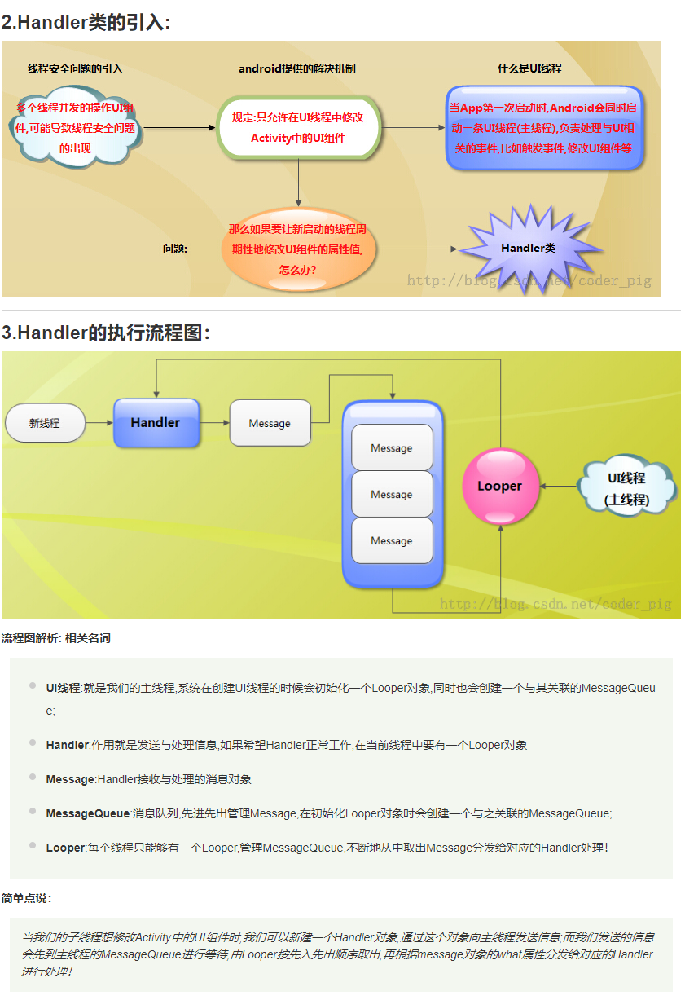
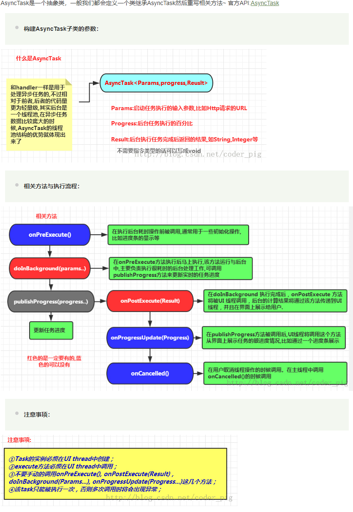

# AnsyncTask学习
### 相关概念
1.应用程序(Application)：为了完成特定任务，用某种语言编写的一组指令集合(一组静态代码)
2.进程(Process) :运行中的程序，系统调度与资源分配的一个独立单位，操作系统会为每个进程分配 一段内存空间，程序的依次动态执行，经理代码加载 -> 执行 -> 执行完毕的完整过程！
3.线程(Thread)：比进程更小的执行单元，每个进程可能有多条线程，线程需要放在一个进程中才能执行！ 线程是由程序负责管理的！！！而进程则是由系统进行调度的！！！
4.多线程概念(Multithreading)：并行地执行多条指令，将CPU的时间片按照调度算法，分配给各个线程，实际上是分时执行的，只是这个切换的时间很短，用户感觉是同时而已！(不得不吐槽python多线程里的全局锁)

***************************************
Android为很么要引入异步任务：
>因为Android程序刚启动时，会同时启动一个对应的主线程(Main Thread)，这个主线程主要负责处理 与UI相关的事件！有时我们也把他称作UI线程！而在Android App时我们必须遵守这个单线程模型的规则： Android UI操作并不是线程安全的并且这些操作都需要在UI线程中执行！ 假如我们在非UI线程中，比如在主线程中new Thread()另外开辟一个线程，然后直接在里面修改UI控件的值； 此时会抛出下述异常： android.view.ViewRoot$CalledFromWrongThreadException: Only the original thread that created a view hierarchy can touch its views 另外，还有一点，如果我们把耗时的操作都放在UI线程中的话，如果UI线程超过5s没有响应用于请求，那么 这个时候会引发ANR(Application Not Responding)异常，就是应用无响应~ 最后还有一点就是：Android 4.0后禁止在UI线程中执行网络操作~不然会报: android.os.NetworkOnMainThreadException

其它方式更新ui:
>1.在Handler里写好UI更新，然后通过sendMessage()等的方法通知UI 更新，另外别忘了Handler写在主线程和子线程中的区别



**在主线程中,因为系统已经初始化了一个Looper对象,所以我们直接创建Handler对象,就可以进行信息的发送与处理了！**

``` java
//建议写成一个内部类
final Handler myHandler = new Handler()
    {
      @Override
      //重写handleMessage方法,根据msg中what的值判断是否执行后续操作
      public void handleMessage(Message msg) {
        if(msg.what == 0)
           {
             //ui更改，你想干嘛就干嘛！
           }
        }
    };

...

myHandler.sendEmptyMessage(0);

```

**如果handler写在子线程中，则需要我们初始化Looper对象**
>1 )直接调用Looper.prepare()方法即可为当前线程创建Looper对象,而它的构造器会创建配套的MessageQueue;
>2 )创建Handler对象,重写handleMessage( )方法就可以处理来自于其他线程的信息了!
>3 )调用Looper.loop()方法启动Looper

```java
public void run()
        {
            Looper.prepare();
            mHandler = new Handler()
            {
                // 定义处理消息的方法
                @Override
                public void handleMessage(Message msg)
                {
                    if(msg.what == 0){
                     //ui更新
                    }
            };
            Looper.loop();
```


>2.利用Activity.runOnUiThread(Runnable)把更新ui的代码创建在Runnable中,更新UI时，把Runnable 对象

实例
``` java
import android.os.Bundle;
import android.support.v7.app.AppCompatActivity;
import android.widget.Toast;

public class MainActivity extends AppCompatActivity {

    @Override
    protected void onCreate(Bundle savedInstanceState) {
        super.onCreate(savedInstanceState);
        setContentView(R.layout.activity_main);

        //创建一个线程
        new Thread(new Runnable() {

            @Override
            public void run() {

                //延迟两秒
                try {
                    Thread.sleep( 2000 );
                } catch (InterruptedException e) {
                    e.printStackTrace();
                }

                runOnUiThread(new Runnable() {
                    @Override
                    public void run() {
                        Toast.makeText(MainActivity.this, "hah", Toast.LENGTH_SHORT).show();
                    }
                });

            }
        }).start();
    }
}

```
runOnUiThread的实现方式：还是handler的实现方式
```java
    /**
     * Runs the specified action on the UI thread. If the current thread is the UI
     * thread, then the action is executed immediately. If the current thread is
     * not the UI thread, the action is posted to the event queue of the UI thread.
     *
     * @param action the action to run on the UI thread
     */
    public final void runOnUiThread(Runnable action) {
        if (Thread.currentThread() != mUiThread) {
            mHandler.post(action);
        } else {
            action.run();
        }
    }

```

********************

AnsyncTask的使用


1.布局：
``` xml
<?xml version="1.0" encoding="utf-8"?>
<LinearLayout xmlns:android="http://schemas.android.com/apk/res/android"
    android:orientation="vertical"
    android:layout_width="match_parent"
    android:layout_height="match_parent">

    <TextView
        android:id="@+id/ansytext"
        android:layout_height="wrap_content"
        android:layout_width="match_parent"
        android:text="开始执行异步任务"
        android:textColor="@color/black"
        android:textSize="20sp"
        />

    <ProgressBar
        android:id="@+id/progressbar"
        android:layout_height="wrap_content"
        android:layout_width="match_parent"
        style="@style/Widget.AppCompat.ProgressBar.Horizontal"
        />

    <Button
        android:id="@+id/button"
        android:layout_height="wrap_content"
        android:layout_width="wrap_content"
        android:text="点击"
        />

</LinearLayout>
```

2.代码：
``` java
import android.os.AsyncTask;
import android.os.Bundle;
import android.support.annotation.Nullable;
import android.support.v7.app.AppCompatActivity;
import android.util.Log;
import android.view.View;
import android.widget.Button;
import android.widget.ProgressBar;
import android.widget.TextView;


public class AnsyncTaskDemo  extends AppCompatActivity implements View.OnClickListener {

    private ProgressBar progressBar;

    private Button button;

    private TextView textView;

    @Override
    protected void onCreate(@Nullable Bundle savedInstanceState) {
        super.onCreate(savedInstanceState);
        setContentView(R.layout.ansynctask_layout);
        init();

    }

    private void init(){
        progressBar=findViewById(R.id.progressbar);
        button=findViewById(R.id.button);
        textView=findViewById(R.id.ansytext);

        button.setOnClickListener(this);

    }


    @Override
    public void onClick(View view) {
        switch (view.getId()){
            case R.id.button:
                MyAnsyTask myAnsyTask=new MyAnsyTask(textView,progressBar);
                myAnsyTask.execute();

                break;
        }
    }
}


class MyAnsyTask extends AsyncTask<Void,Integer,Boolean>{

    private TextView textView;
    private ProgressBar progressBar;

    public MyAnsyTask(TextView textView,ProgressBar progressBar){
        super();
        this.textView=textView;
        this.progressBar=progressBar;
    }

    @Override
    protected Boolean doInBackground(Void... voids) {
        int j=10;
        for ( ; j < 100; j+=10) {
            try {
                new Thread().sleep(1000);
                publishProgress(j);//通知进行ui更新
            } catch (InterruptedException e) {
                e.printStackTrace();
            }
        }
        return true;
    }

    @Override
    protected void onPreExecute() {
        //开始执行异步任务前的操作
        textView.setText("开始执行");
    }

    @Override
    protected void onProgressUpdate(Integer... values) {
        //在此进行ui更新
        int i=values[0];
        progressBar.setProgress(i);
    }

    @Override
    protected void onPostExecute(Boolean aBoolean) {
        super.onPostExecute(aBoolean);
        //在此进行结束操作，可以进行ui更行
        if (aBoolean){
            progressBar.setProgress(100);
            textView.setText("执行完毕");
        }
    }
}

```
>1.myAnsyTask.execute();必须要写，否则会报错！

>2.AsyncTask<Void,Integer,Boolean>,这三个参数很重要
