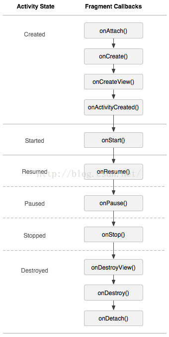
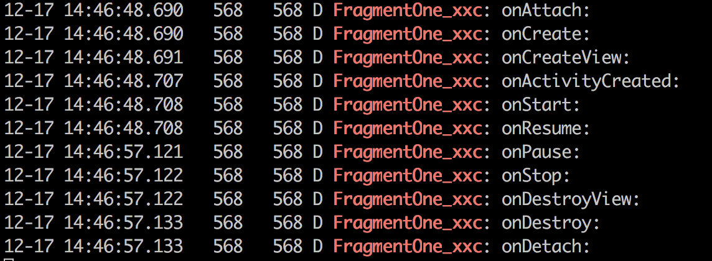
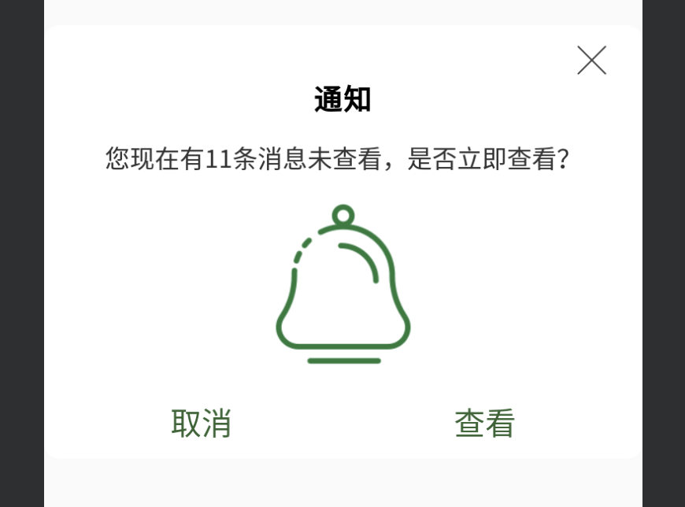

## Fragment学习

####  1.Fragment周期



log打印：



##### 周期说明

1. ###### onAttach()
 
   这个是回调函数
   这个时候 activity已经传进来了,获得activity的传递的值
   就可以进行 与activity的通信里
   当然也可以使用getActivity(),前提是这个fragment已经和宿主的activity关联，
   并且没有脱离
   只调用一次

2. ###### onCreate()

   系统创建fragment的时候回调他，在他里面实例化一些变量
   这些个变量主要是：当你 暂停 停止的时候 你想保持的数据
   如果我们要为fragment启动一个后台线程，可以考虑将代码放于此处。
   参数是：Bundle savedInstance, 用于保存 Fragment 参数,
   Fragement也可以重写 onSaveInstanceState(BundleoutState)方法, 
   保存Fragement状态;可以用于 文件保护

   只调用一次

3. ###### onCreateView()

   第一次使用的时候 fragment会在这上面画一个layout出来，
   为了可以画控件 要返回一个 布局的view，也可以返回null
   当系统用到fragment的时候 fragment就要返回他的view，越快越好，
   所以尽量在这里不要做耗时操作，比如从数据库加载大量数据显示listview，当然线程还是可以的。
   给当前的fragment绘制ui布局，可以使用线程更新UI,说白了就是加载fragment的布局的。

   ```java
   //一般要判断是否为空，来减少资源的消耗
   if (view == null) {
       view = inflater.inflate(R.layout.hello, null);
   }
   ```

4. ###### onActivityCteated

   当Activity中的onCreate方法执行完后调用。    
   注意了：
   从这句官方的话可以看出：当执行onActivityCreated()的时候 activity的onCreate才刚完成。
   所以在onActivityCreated()调用之前 activity的onCreate可能还没有完成，
   所以不能再onCreateView()中进行 与activity有交互的UI操作，UI交互操作可以砸onActivityCreated()里面进行。
   所以：这个方法主要是初始化那些你需要你的父Activity或者Fragment的UI已经被完整初始化才能初始化的元素。可以在此处初始化list view

5. ###### onStart()

   和activity等同 
   启动, Fragement 启动时回调, 此时Fragement可见

6. ###### onResume()

   和activity等同 
   在activity中运行是可见的激活, Fragement 进入前台, 可获取焦点时激活;

7. ###### onPause()

   和activity等同   
   其他的activity获得焦点，这个仍然可见第一次调用的时候，
   指的是 用户 离开这个fragment（并不是被销毁）
   通常用于 用户的提交（可能用户离开后不会回来了）

8. ###### onStop()
 
   和activity等同 
   fragment不可见的，可能情况：activity被stopped了 OR  fragment被移除但被加入到回退栈中
   一个stopped的fragment仍然是活着的如果长时间不用也会被移除

9. ###### onDestroyView()

   Fragment中的布局被移除时调用。
   表示fragemnt销毁相关联的UI布局清除所有跟视图相关的资源

   ViewPager+Fragment，由于ViewPager的缓存机制，每次都会加载3页，

   可以在此处移除view，来 解决view的重复加载问题；

   ```java
   public void onDestroyView() {
      if(view!=null){
            ((ViewGroup)view.getParent()).removeView(view);
      }
      super.onDestroyView();
   }
   ```

10. ###### onDestroy()

    销毁fragment对象时调用

11. ###### onDetach()

    与Activity解除绑定时调用


####  2.动态添加Fragment

```java
 FragmentManager fm = getSupportFragmentManager();
 FragmentTransaction transaction = fm.beginTransaction();
 if (mFragmentOne==null){
                    mFragmentOne = new FragmentOne();
    }
 if (mFragmentOne!=null&&mFragmentOne.isVisible()){
                    return;
    }
  //transaction = fm.beginTransaction();//每次开启事务时都要写，否则会报错
  transaction.add(R.id.linearlayout, mFragmentOne);
  transaction.commit();//提交后才会生效
```


####3.管理Fragment回退栈

```java
FragmentTransaction.addToBackStack(String)
```


####4.Fragment与Activity通信

在Fragment中可以通过getActivity得到当前绑定的Activity的实例，然后进行操作。

```java
Button button=getActivity().findViewById(R.id.button_add);
button.setText("hello");
```

#### 5.处理屏幕旋转问题

当屏幕发生旋转，Activity发生重新启动，默认的Activity中的Fragment也会跟着Activity重新创建；这样造成当旋转的时候，本身存在的Fragment会重新启动，然后当执行Activity的onCreate时，又会再次实例化一个新的Fragment

解决方法：在activity中的onCreate()方法中使用savedInstanceState中做判断

```java
 @Override
    public void onCreate(Bundle savedInstanceState) {
        super.onCreate(savedInstanceState);
        setContentView(R.layout.fragmentstudy_activity);
        if (savedInstanceState==null) {
            initLayouts();
        }

    }
```

####6.Fragment数据保存

和Activity类似，Fragment也有onSaveInstanceState的方法，在此方法中进行保存数据，然后在onCreate或者onCreateView或者onActivityCreated进行恢复都可以

#### 7.没有布局的Fragment的作用

没有布局文件Fragment实际上是为了保存，当Activity重启时，保存大量数据准备的

[Android 屏幕旋转 处理 AsyncTask 和 ProgressDialog 的最佳方案](https://blog.csdn.net/lmj623565791/article/details/37936275)

####8.Fragment创建对话框

1.像创建普通的AlertDialog的方法创建FragmentDialog

```java

public class CustomeFragmentDialog extends DialogFragment {
    //重写此方法即可
    @NonNull
    @Override
    public Dialog onCreateDialog(@Nullable Bundle savedInstanceState) {

        AlertDialog.Builder builder = new AlertDialog.Builder(getActivity());
        builder.setTitle("Tips");
        builder.setMessage("你好，这是一个dialogfragment的例子!");
        builder.setPositiveButton("ok", new DialogInterface.OnClickListener() {
            @Override
            public void onClick(DialogInterface dialog, int which) {
                Toast.makeText(getActivity(), "hello", Toast.LENGTH_SHORT).show();
            }
        });
        builder.setNegativeButton("no", new DialogInterface.OnClickListener() {
            @Override
            public void onClick(DialogInterface dialog, int which) {
                dialog.dismiss();
            }
        });
        //设置点击外部不可取消
        setCancelable(false);
        return builder.create();
    }
}
```

2.创建自定义的dialog

布局：

custome_fragment_dialog_layout.xml

```xml
<?xml version="1.0" encoding="utf-8"?>
<LinearLayout xmlns:android="http://schemas.android.com/apk/res/android"
    xmlns:tools="http://schemas.android.com/tools"
    android:orientation="vertical"
    android:layout_width="match_parent"
    android:layout_gravity="center"
    android:background="@drawable/fragment_dialog_backgroud"
    android:layout_height="wrap_content">


    <ImageView
        android:id="@+id/colose_img"
        android:layout_width="25dp"
        android:layout_height="25dp"
        android:src="@drawable/shanchu"
        android:layout_gravity="right"
        android:layout_marginTop="10dp"
        android:layout_marginRight="20dp"
        android:visibility="visible"
        />

    <TextView
        android:id="@+id/title"
        android:layout_height="wrap_content"
        android:layout_width="wrap_content"
        android:text="通知"
        android:layout_gravity="center"
        android:gravity="center"
        android:textSize="18sp"
        android:textColor="@android:color/black"
        android:textStyle="bold"
        android:visibility="visible"
        />

    <TextView
        android:id="@+id/message"
        android:layout_height="wrap_content"
        android:layout_width="wrap_content"
        android:text="您现在有11条消息未查看，是否立即查看？"
        android:layout_gravity="center"
        android:gravity="center"
        android:textColor="#333333"
        android:textSize="16sp"
        android:layout_marginTop="15dp"
        android:visibility="visible"
        />

    <ImageView
        android:layout_marginTop="10dp"
        android:id="@+id/content_img"
        android:layout_width="120dp"
        android:layout_height="120dp"
        android:src="@drawable/notification"
        android:layout_gravity="center"
        android:layout_marginBottom="5dp"
        android:visibility="visible"
        />


    <LinearLayout
        android:id="@+id/resume_layout"
        android:layout_height="wrap_content"
        android:layout_width="match_parent"
        android:padding="10dp"
        android:orientation="horizontal"
        >

    <TextView
        android:id="@+id/cancel_textview"
        android:layout_height="wrap_content"
        android:layout_width="wrap_content"
        android:layout_gravity="center"
        android:gravity="center"
        android:text="取消"
        android:textSize="20sp"
        android:textColor="#326432"
        android:layout_weight="1"
        android:visibility="visible"
        />
        
        <TextView
            android:layout_weight="1"
            android:id="@+id/confirme_textview"
            android:layout_height="wrap_content"
            android:layout_width="wrap_content"
            android:layout_gravity="center"
            android:gravity="center"
            android:text="查看"
            android:textSize="20sp"
            android:textColor="#326432"
            android:visibility="visible"
            />
    </LinearLayout>
</LinearLayout>
```

fragment_dialog_backgroud.xml

```xml
<?xml version="1.0" encoding="utf-8"?>
<shape xmlns:android="http://schemas.android.com/apk/res/android">


    <solid
        android:color="#ffff"
        />

    <corners
        android:radius="10dp"
        />

</shape>
```


自定义布局代码：

```java

import android.app.Dialog;
import android.os.Bundle;
import android.support.annotation.NonNull;
import android.support.annotation.Nullable;
import android.support.v4.app.DialogFragment;
import android.util.DisplayMetrics;
import android.view.Gravity;
import android.view.LayoutInflater;
import android.view.View;
import android.view.ViewGroup;
import android.view.WindowManager;
import android.widget.ImageView;
import android.widget.TextView;

import com.example.xxc.studydemo.R;

public class CustomeFragmentDialog extends DialogFragment{

    private ImageView closeImage;

    private ImageView contentImage;

    private TextView titleTextView;

    private TextView messageTextView;

    private TextView confirmeTextView;

    private TextView cancelTextView;

    private int closeImageSrc = 0;

    private int contentImageSrc = 0;

    private String title;

    private String message;

    private String confirmeTxt;

    private String cancelText;

    public interface  onConfirmeClick{
        void  confirmeClickListener();
    }

    public interface  onCancelClick{
        void  cancelClickListener();
    }

    private onConfirmeClick mOnConfirmeCLick;

    private onCancelClick mOnCancelClick;


    public void setOnConfirmeCLickListener(onConfirmeClick mOnConfirmeClick){
        this.mOnConfirmeCLick = mOnConfirmeClick;
    }

    public void setOnCancelClick (onCancelClick mOnCancelClick){
        this.mOnCancelClick = mOnCancelClick;
    }

    @Override
    public void onStart() {
        super.onStart();
        //在此处设置dialog的大小
        Dialog dialog = getDialog();
        if (dialog != null) {
            DisplayMetrics dm = new DisplayMetrics();
            getActivity().getWindowManager().getDefaultDisplay().getMetrics(dm);
            WindowManager.LayoutParams attributes = dialog.getWindow().getAttributes();
            attributes.gravity = Gravity.CENTER;//对齐方式
            dialog.getWindow().setAttributes(attributes);
            dialog.getWindow().setLayout((int) (dm.widthPixels * 0.9), ViewGroup.LayoutParams.WRAP_CONTENT);
        }
        setCancelable(false);
    }

    @Override
    public void onCreate(@Nullable Bundle savedInstanceState) {
        super.onCreate(savedInstanceState);

        setStyle(DialogFragment.STYLE_NORMAL,R.style.FragmentTheme);

    }

    @Nullable
    @Override
    public View onCreateView(@NonNull LayoutInflater inflater, @Nullable ViewGroup container, @Nullable Bundle savedInstanceState) {


        View view = inflater.inflate(R.layout.custome_fragment_dialog_layout,container,false);

        closeImage = view.findViewById(R.id.colose_img);

        titleTextView = view.findViewById(R.id.title);

        messageTextView = view.findViewById(R.id.message);

        contentImage = view.findViewById(R.id.content_img);

        confirmeTextView = view.findViewById(R.id.confirme_textview);

        cancelTextView = view.findViewById(R.id.cancel_textview);

        if (closeImageSrc!=0){
            closeImage.setImageResource(closeImageSrc);
        }else {
            setViewVisible(closeImage,false);
        }

        if (contentImageSrc!=0){
            contentImage.setImageResource(contentImageSrc);
        }else {
            setViewVisible(contentImage,false);
        }

        if (title!=null){
            titleTextView.setText(title);
        }else {
            setViewVisible(titleTextView,false);
        }

        if (message!=null){
            messageTextView.setText(message);
        }else {
            setViewVisible(messageTextView,false);
        }

        if (confirmeTxt!=null){
            confirmeTextView.setText(confirmeTxt);
        }else {
            setViewVisible(confirmeTextView,false);
        }

        if (cancelText!=null){
            cancelTextView.setText(cancelText);
        }else {
            setViewVisible(cancelTextView,false);
        }

        closeImage.setOnClickListener(new View.OnClickListener() {
            @Override
            public void onClick(View v) {
                getDialog().dismiss();
            }
        });


        confirmeTextView.setOnClickListener(new View.OnClickListener() {
            @Override
            public void onClick(View v) {
                mOnConfirmeCLick.confirmeClickListener();
            }
        });

        cancelTextView.setOnClickListener(new View.OnClickListener() {
            @Override
            public void onClick(View v) {
                mOnCancelClick.cancelClickListener();
            }
        });


        return view;
    }

    public void setCloseImage(int imageSrc){

        closeImageSrc = imageSrc;

    }

    public void setTitleTextView(String pTitleTextView){

        title = pTitleTextView;

    }

    public void setMessageTextView(String message){

        this.message = message;
    }

    public void setContentImage(int imageSrc){

        contentImageSrc = imageSrc;

    }

    public void setConfirmeTextView(String pConfirmeStr){

        confirmeTxt = pConfirmeStr;
    }

    public void setCancelTextView(String pCancelStr){
        cancelText = pCancelStr;
    }

    private void setViewVisible(View mView,boolean isVisible){

        if (mView==null){
            return;
        }
        if (isVisible){
            mView.setVisibility(View.VISIBLE);
        }else {
            mView.setVisibility(View.GONE);

        }
    }

}

```

主题：

```xml

    <style name="FragmentTheme">
        <item name="android:windowBackground">@android:color/transparent</item>
        <item name="android:windowNoTitle">true</item>
    </style>
```

在activity中调用：

```java
 //自定义dialogfragment
final CustomeFragmentDialog customeFragmentDialog = new CustomeFragmentDialog();
customeFragmentDialog.show(getSupportFragmentManager(),"dialogfragment");
customeFragmentDialog.setCloseImage(R.drawable.shanchu);
customeFragmentDialog.setTitleTextView("通知!");
customeFragmentDialog.setMessageTextView("您现在有12条信息,是否现在立即查看?");
customeFragmentDialog.setContentImage(R.drawable.notification);
customeFragmentDialog.setConfirmeTextView("查看");
customeFragmentDialog.setOnConfirmeCLickListener(new CustomeFragmentDialog.onConfirmeClick() {
                     @Override
                     public void confirmeClickListener() {
                         Toast.makeText(FragmentStudy.this, "hello",Toast.LENGTH_SHORT).show();
                         customeFragmentDialog.dismiss();
                     }
                 });
```

效果:



