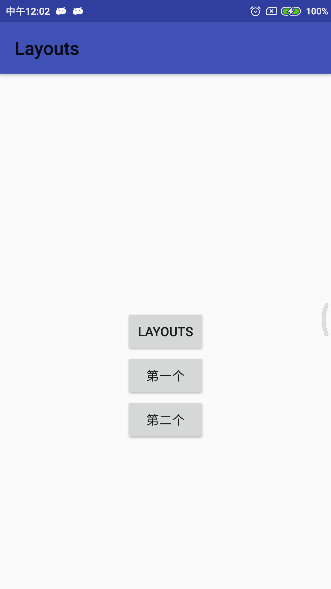

#PopupWindwo的基本使用
介绍：这是一个可以显示任何view的弹窗控件，而且会浮动在当前actiivity的顶部
>注意：AlertDialog是非堵塞线程，而Popupwindow是堵塞线程的
****

用法：

自定义的popupwindow视图:custome_popwindow.xml
```xml
<?xml version="1.0" encoding="utf-8"?>
<LinearLayout
    xmlns:android="http://schemas.android.com/apk/res/android"
    android:layout_width="match_parent"
    android:layout_height="match_parent"
    android:orientation="vertical"
    >

    <Button
        android:id="@+id/firstButton"
        android:layout_height="wrap_content"
        android:layout_width="wrap_content"
        android:text="第一个"
        />

    <Button
        android:id="@+id/seecondButton"
        android:layout_height="wrap_content"
        android:layout_width="wrap_content"
        android:text="第二个"
        />

</LinearLayout>
```

>java代码
```java
package com.example.xxc.popwindowsdemo;

import android.content.Context;
import android.graphics.drawable.ColorDrawable;
import android.os.Bundle;
import android.support.annotation.Nullable;
import android.support.v7.app.AppCompatActivity;
import android.view.LayoutInflater;
import android.view.MotionEvent;
import android.view.View;
import android.view.ViewGroup;
import android.widget.Button;
import android.widget.PopupWindow;
import android.widget.Toast;
import com.example.xxc.layouts.R;

public class PopWindowsDemo extends AppCompatActivity {

    private Button button;

    @Override
    protected void onCreate(@Nullable Bundle savedInstanceState) {
        super.onCreate(savedInstanceState);
        setContentView(R.layout.popwindows_layout);

        init();
    }


    private void init(){
        button=findViewById(R.id.button);

        button.setOnClickListener(new View.OnClickListener() {
            @Override
            public void onClick(View v) {
                initPopWindow(v,PopWindowsDemo.this);
            }
        });

    }


   private void initPopWindow(View v, final Context mContext){
        //在此加载自定义的视图
        View view=LayoutInflater.from(mContext).inflate(R.layout.custome_popwindow,null,false);
        Button firstButton=view.findViewById(R.id.firstButton);
        Button secondButton=view.findViewById(R.id.seecondButton);
        final PopupWindow popupWindow=new PopupWindow(view,ViewGroup.LayoutParams.WRAP_CONTENT,
                ViewGroup.LayoutParams.WRAP_CONTENT,true);
        //设置加载动画
//        popupWindow.setAnimationStyle();


       //设置点击非popupwindow区域，控件消失
       popupWindow.setTouchable(true);
       popupWindow.setTouchInterceptor(new View.OnTouchListener() {
           @Override
           public boolean onTouch(View v, MotionEvent event) {
                //如果返回true，touch 事件将会被拦截
               //拦截后，popupwindow的onTouchEvent不被调用，这样点击外部区域无法dismiss
               //控件中点击操作也无法进行
               return false;
           }
       });
       //设置一个背景
       popupWindow.setBackgroundDrawable(new ColorDrawable(0x00000000));

       //设置焦点，什么是焦点，简答理解windows中的鼠标即可
       popupWindow.setFocusable(true);

       //设置popupwindow的位置，相对某个控件的位置，参数依次是参照ｖｉｅｗ,x轴的偏移量，ｙ轴的偏移量
       popupWindow.showAsDropDown(v,0,0);

       //设置popupwindow的位置，正下方
//       popupWindow.showAsDropDown(v);

       //设置popupwindow的位置，相对于父控件的位置，parent这个参数只要是activity中的view即可
//       popupWindow.showAtLocation(v,Gravity.CENTER,0,0);

       //设置点击事件
       firstButton.setOnClickListener(new View.OnClickListener() {
           @Override
           public void onClick(View v) {
               showToast("firstButton click this button",mContext);
           }
       });

       secondButton.setOnClickListener(new View.OnClickListener() {
           @Override
           public void onClick(View v) {
               showToast("secondButton click this button",mContext);
               //控件消失
               popupWindow.dismiss();
           }
       });

   }

   private void showToast(String str,Context mContext){
        if (null==str||str.equals("")){
            //输入内容为空
            str="输入内容为空";
        }
       Toast.makeText(mContext, str, Toast.LENGTH_SHORT).show();
   }

}

```

效果如下图所示：


