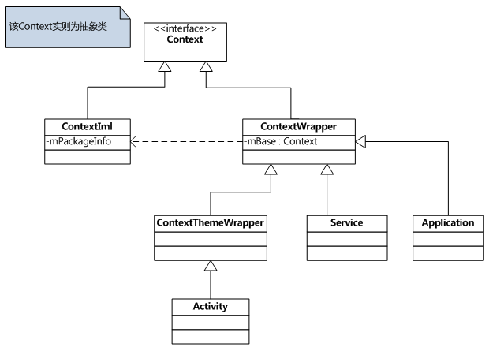
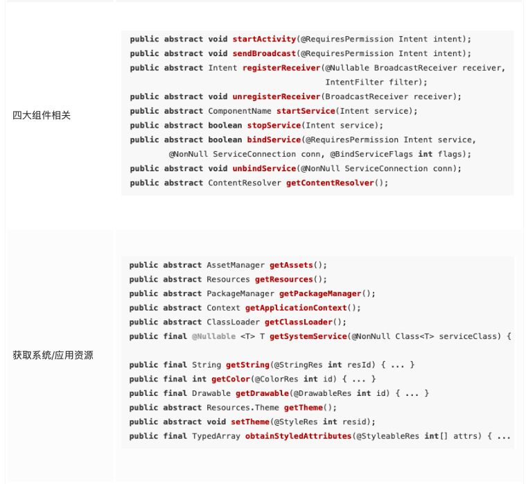
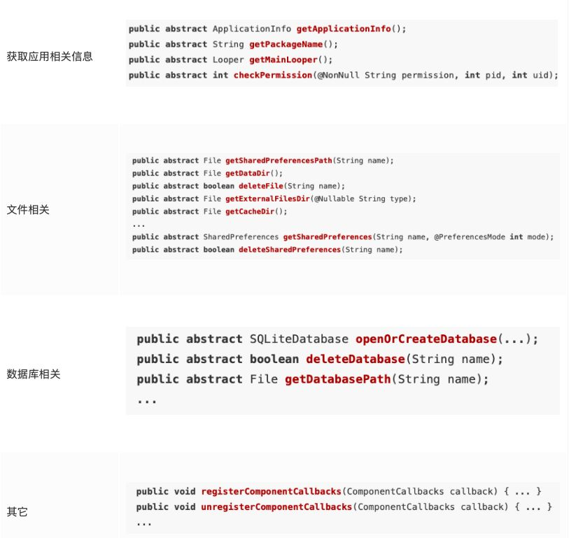
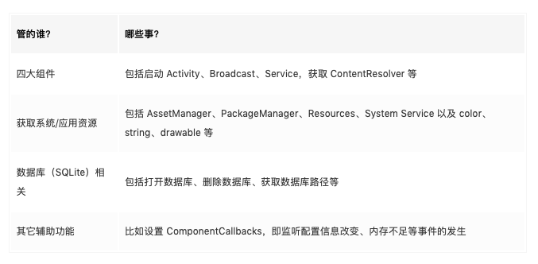
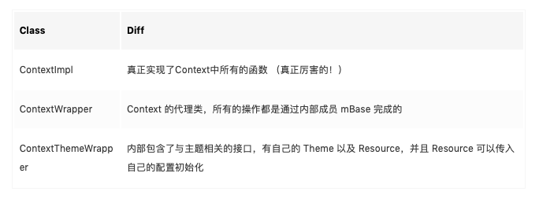
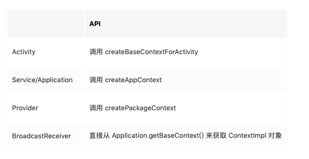
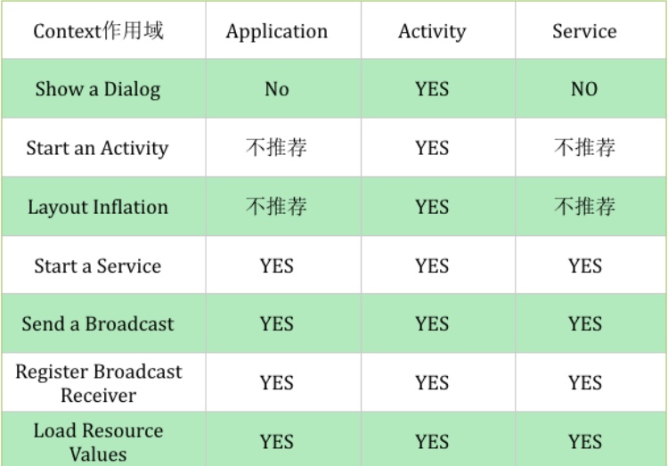

# Context学习

## 什么是Context

Android程序不像Java程序一样，随便创建一个类，写个main()方法就能跑了，而是要有一个完整的Android工程环境，在这个环境下，像Activity、Service、BroadcastReceiver等系统组件，而这些组件并不是像一个普通的Java对象new一下就能创建实例的了，而是要有它们各自的上下文环境，也就是Context。可以这样讲，Context是维持Android程序中各组件能够正常工作的一个核心功能类。

Contex继承结构:



可以看到，直系子类有两个，一个是ContextWrapper，一个是ContextImpl。那么从名字上就可以看出，ContextWrapper是上下文功能的封装类，而ContextImpl则是上下文功能的实现类。而ContextWrapper又有三个直接的子类，ContextThemeWrapper、Service和Application。其中，ContextThemeWrapper是一个带主题的封装类，而它有一个直接子类就是Activity。

Context一共有三种类型，分别是Application、Activity和Service。这三个类虽然分别各种承担着不同的作用，但它们都属于Context的一种，而它们具体Context的功能则是由ContextImpl类去实现的。

那么Context到底可以实现哪些功能呢？这个就实在是太多了，弹出Toast、启动Activity、启动Service、发送广播、操作数据库等等等等都需要用到Context。由于Context的具体能力是由ContextImpl类去实现的，因此在绝大多数场景下，Activity、Service和Application这三种类型的Context都是可以通用的。不过有几种场景比较特殊，比如启动Activity，还有弹出Dialog。出于安全原因的考虑，Android是不允许Activity或Dialog凭空出现的，一个Activity的启动必须要建立在另一个Activity的基础之上，也就是以此形成的返回栈。而Dialog则必须在一个Activity上面弹出（除非是System Alert类型的Dialog），因此在这种场景下，我们只能使用Activity类型的Context，否则将会出错。

Context提供的方法:









不同的组件创建Context的方式:



## Context数量

Context一共有Application、Activity和Service三种类型，因此一个应用程序中Context数量的计算公式就可以这样写：

``` text
Context数量 = Activity数量 + Service数量 + 1
```

上面的1代表着Application的数量，因为一个应用程序中可以有多个Activity和多个Service，但是只能有一个Application。

## Application Context的设计

基本上每一个应用程序都会有一个自己的Application，并让它继承自系统的Application类，然后在自己的Application类中去封装一些通用的操作。

1. 创建一个类`MainActivity`:

``` java
import android.app.Application;
public class BasicApplication extends Application {}
```

2. 在清单文件中说明:

```xml
 <application
        android:name=".BasicApplication"
        android:allowBackup="true"
        android:icon="@mipmap/ic_launcher"
        android:label="@string/app_name"
        android:roundIcon="@mipmap/ic_launcher_round"
        android:supportsRtl="true"
        android:theme="@style/AppTheme">
```

### 获取Context的方法:

```  java
Log.d(TAG, "application: "+getApplication());
Log.d(TAG, "context: "+getApplicationContext());
Log.d(TAG, "basecontext: "+getBaseContext());

----
  
application: com.example.basicdemo.MainActivity@d4ef8b1
context: com.example.basicdemo.MainActivity@d4ef8b1
basecontext: android.app.ContextImpl@44c0196
```

1. `getApplication`与`getApplicationContext`得到的对象相同，而且就连内存地址都相同!

####  `getApplication`与`getApplicationContext`的区别:

getApplication()方法的语义性非常强，一看就知道是用来获取Application实例的，但是这个方法只有在Activity和Service中才能调用的到。那么也许在绝大多数情况下我们都是在Activity或者Service中使用Application的，但是如果在一些其它的场景，比如BroadcastReceiver中也想获得Application的实例，这时就可以借助getApplicationContext()方法了。

也就是说，getApplicationContext()方法的作用域会更广一些，任何一个Context的实例，只要调用getApplicationContext()方法都可以拿到Application对象。

2. `getBaseContext`方法:

看输出的情况是一个`ContextImpl`对象,即上下文的具体功能实现类。也就是说像Application、Activity这样的类其实并不会去具体实现Context的功能，而仅仅是做了一层接口封装而已，Context的具体功能都是由ContextImpl类去完成的。

``` java
/**
 * Proxying implementation of Context that simply delegates all of its calls to
 * another Context.  Can be subclassed to modify behavior without changing
 * the original Context.
 */
public class ContextWrapper extends Context {
    Context mBase;
    
    /**
     * Set the base context for this ContextWrapper.  All calls will then be
     * delegated to the base context.  Throws
     * IllegalStateException if a base context has already been set.
     * 
     * @param base The new base context for this wrapper.
     */
    protected void attachBaseContext(Context base) {
        if (mBase != null) {
            throw new IllegalStateException("Base context already set");
        }
        mBase = base;
    }
 
    /**
     * @return the base context as set by the constructor or setBaseContext
     */
    public Context getBaseContext() {
        return mBase;
    }
 
    @Override
    public AssetManager getAssets() {
        return mBase.getAssets();
    }
 
    @Override
    public Resources getResources() {
        return mBase.getResources();
    }

...
}
```

看第16行的attachBaseContext()方法，这个方法中传入了一个base参数，并把这个参数赋值给了mBase对象。而attachBaseContext()方法其实是由系统来调用的，它会把ContextImpl对象作为参数传递到attachBaseContext()方法当中，从而赋值给mBase对象，之后ContextWrapper中的所有方法其实都是通过这种委托的机制交由ContextImpl去具体实现的，所以说ContextImpl是上下文功能的实现类是非常准确的。

## 使用Application的问题

谨记一点，Application全局只有一个，它本身就已经是单例了，无需再用单例模式去为它做多重实例保护了

``` java
public class BasicApplication extends Application {

    private static final String TAG = "MainActivity";

    private static  BasicApplication mainActivity;

    public BasicApplication() {
        //记住不能在构造函数中初始化
        Log.d(TAG, "MainActivity:1");
    }

    @Override
    protected void attachBaseContext(Context base) {
        super.attachBaseContext(base);
        Log.d(TAG, "attachBaseContext: 2");
    }

    public static BasicApplication getInstance(){
        return mainActivity;
    }

    @Override
    public void onCreate() {
        super.onCreate();
        Log.d(TAG, "onCreate: 3");
        mainActivity = this;
    }
}
```

## 正确的位置使用Context 



> **Activity很重要,无所不能!**

版权声明：本文为CSDN博主「guolin」的原创文章，遵循CC 4.0 BY-SA版权协议，转载请附上原文出处链接及本声明。
原文链接：https://blog.csdn.net/sinyu890807/java/article/details/47028975


