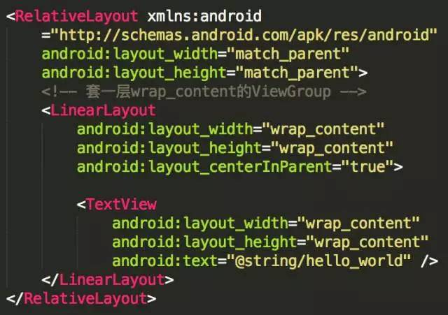

# TextView相关

## 左右滑动实现

实现android文本框的触摸左右滑动，不需要自定自定义什么的，直接textview就自带了，如下（以左右滑动为列子）：

### `xml`布局文件中定义：

``` xml
<TextView  				  
    android:text="sdfkshfjksdjkfjkasdhflkasbfklasbfklasbflndsbfklnasbfklnbadskfbadskf"
    android:layout_width="wrap_content"
    android:maxLines="1"  //这个不要用singleline,不然滑动了是没反应的
    android:scrollbars="vertical"  //你也可以设置为horizontal,设置成vertical的话，下部是不会有滑动框了就
    android:id="@+id/tv"
    android:layout_height="wrap_content" />
```

**事实上这个布局里只配置maxLines 就可以了**


### `Java`代码中设置:

``` java
tv = findViewById(R.id.tv);
tv.setMovementMethod(ScrollingMovementMethod.getInstance());
tv.setHorizontallyScrolling(true);
tv.setFocusable(true);   //实际不写也可以
```


### 问题

设置textview可滑动，如果你的场景是作为listview中的一个item的话，可能会影响到它的事件分发，即listview设置setOnItemClicklistener 无法生效，需要进行分别对应的点击事件的设置才行，用listview的item中外层的大view进行点击事件的设置同样是不行的。

> 版权声明：本文为CSDN博主「通俗」的原创文章，遵循CC 4.0 BY-SA版权协议，转载请附上原文出处链接及本声明。
> 原文链接：https://blog.csdn.net/xiaochenuu/java/article/details/80598127

## 一行居中，多行居左的效果

这个一般用于提示信息对话框，如果文字是一行就居中，多行就居左。在TextView外套一层wrap_content的ViewGroup即可简单实现：



## setCompoundDrawablesWithIntrinsicBounds()

网上一大堆setCompoundDrawables()方法无效不显示的问题，然后解决方法是setBounds，需要计算大小…

不用这么麻烦，用setCompoundDrawablesWithIntrinsicBounds()这个方法最简单！