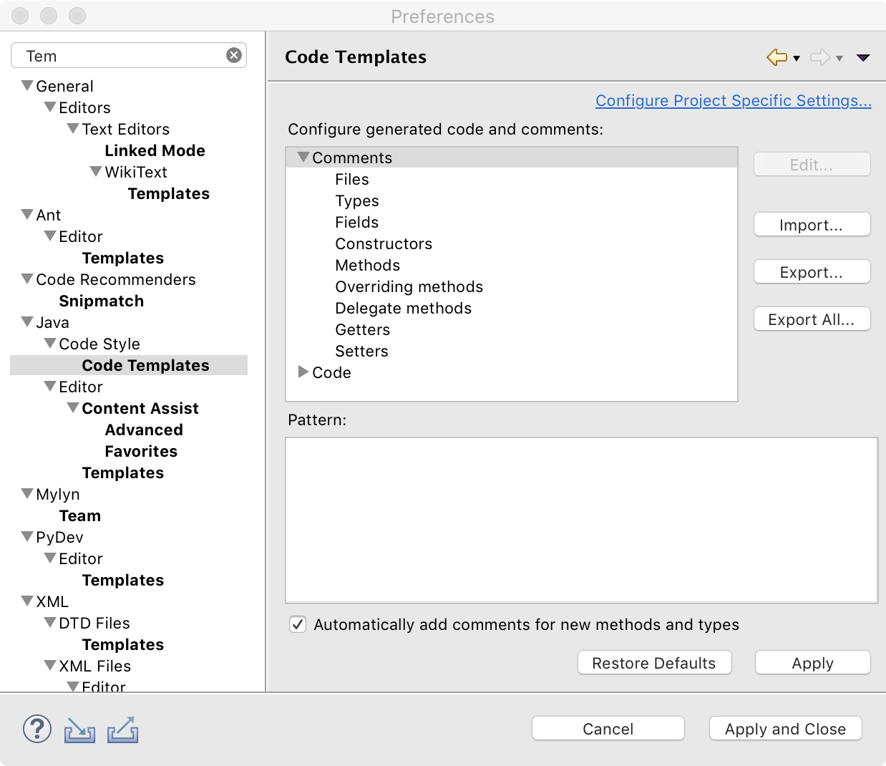
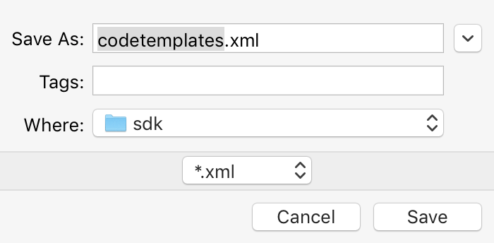

# eclipse 注释设置及其自定义

##  一.设置注释模板

1.设置注释模板的入口：Window->Preference->Java->Code Style->Code Template

2.然后展开Comments节点就是所有需设置注释的元素了！

3.点击右侧面板上的按钮 – 编辑(Edit)， 便可修改注释



## 二.详细介绍

1.文件(Files)注释标签

> Files标签是对新建文件的说明，出现在文件的最上面

推荐注释风格

```text
/**
 * 功能描述：
 * @Package: ${package_name} 
 * @author: ${user}   
 * @date: ${date} ${time} 
 */
```

2.类型(Types)注释标签（类的注释）

> Types标签是对类Class文件的一个说明，出现在类的上面

推荐注释风格

```text
/**   
 * 
 * @ClassName: ${file_name}
 * @Description: 该类的功能描述
 *
 * @version: v1.0.0
 * @author: ${user}
 * @date: ${date} ${time} 
 *
 * Modification History:
 * Date         Author          Version            Description
 *---------------------------------------------------------*
 * ${date}     ${user}           v1.0.0               修改原因
 */
```

3.字段(Fields)注释标签

> 字段(Fields)注释标签是对变量字段的说明

推荐注释风格

```text
// @Fields ${field} : ${todo}
```

4.构造函数(Constructors)注释标签

> 构造函数(Constructors)注释标签是对构造函数的说明,出现在构造函数的上方

推荐注释风格

```text
/**   
 * @Function: ${file_name}
 * @Description: 该函数的功能描述
 * 
 * ${tags}
 * @author: ${user}
 * @date: ${date} ${time} 
 */
```

5.方法(Method)标签

> 方法注释标签是对方法的说明

推荐注释风格

```text
/**   
 * @Function: ${file_name}
 * @Description: 该函数的功能描述
 *
 * ${tags}
 * @return：返回结果描述
 * @throws：异常描述
 *
 * @version: v1.0.0
 * @author: ${user}
 * @date: ${date} ${time} 
 *
 * Modification History:
 * Date         Author          Version            Description
 *---------------------------------------------------------*
 * ${date}     ${user}           v1.0.0               修改原因
 */
```

6.覆盖方法(Overriding Methods)标签

> 覆盖方法标签，是对覆盖方法的说明

推荐注释风格

```text
/** 
 * ${see_to_overridden}  
 * @Function: ${file_name}
 * @Description: 该函数的功能描述
 *
 * ${tags}
 * @return：返回结果描述
 * @throws：异常描述
 *
 * @version: v1.0.0
 * @author: ${user}
 * @date: ${date} ${time} 
 *
 * Modification History:
 * Date         Author          Version            Description
 *---------------------------------------------------------*
 * ${date}     ${user}           v1.0.0               修改原因
 */
```

7.代表方法(Delegate Methods)标签

> 不知道啥是代表方法？

8.Getter,Setter方法标签

> Getter,Setter方法标签，对Getter,Setter方法的说明

getter推荐注释风格：

```text
/**
 * @return the ${bare_field_name}
 */
```

seter推荐注释风格:

```text
/**
 * @param ${param} the ${bare_field_name} to set
 */
```

## 三.新建文件时如何自动添加注释

只需要勾选Automatically and comments for new methods and types即可！


## 四.导入导出注释模板

1.导出注释模板

点击上图中的Export…按钮即可将注释模板导出，注释模板名称为:codetemplates.xml



2.导入注释模板

点击上图中的Import…按钮即可将注释模板导入


## 五.总结

按照上述推荐的注释风格，可以满足大多数的注释需求，合理的选择和组合注释模板，可以让代码具有更好的阅读性和可维护性。

## 六.附件

注释模板:codetemplates.xml

```xml
<?xml version="1.0" encoding="UTF-8" standalone="no"?><templates><template autoinsert="true" context="settercomment_context" deleted="false" description="Comment for setter method" enabled="true" id="org.eclipse.jdt.ui.text.codetemplates.settercomment" name="settercomment">/**
 * @param ${param} the ${bare_field_name} to set
 */</template><template autoinsert="false" context="methodcomment_context" deleted="false" description="Comment for non-overriding methods" enabled="true" id="org.eclipse.jdt.ui.text.codetemplates.methodcomment" name="methodcomment">/**   
 * @Function: ${file_name}
 * @Description: 该函数的功能描述
 *
 * ${tags}
 * @return：返回结果描述
 * @throws：异常描述
 *
 * @version: v1.0.0
 * @author: ${user}
 * @date: ${date} ${time} 
 *
 * Modification History:
 * Date         Author          Version            Description
 *---------------------------------------------------------*
 * ${date}     ${user}           v1.0.0               修改原因
 */
</template><template autoinsert="false" context="fieldcomment_context" deleted="false" description="Comment for fields" enabled="true" id="org.eclipse.jdt.ui.text.codetemplates.fieldcomment" name="fieldcomment">/**
 * @Fields ${field} : ${todo}
 */</template><template autoinsert="true" context="gettercomment_context" deleted="false" description="Comment for getter method" enabled="true" id="org.eclipse.jdt.ui.text.codetemplates.gettercomment" name="gettercomment">/**
 * @return the ${bare_field_name}
 */</template><template autoinsert="false" context="delegatecomment_context" deleted="false" description="Comment for delegate methods" enabled="true" id="org.eclipse.jdt.ui.text.codetemplates.delegatecomment" name="delegatecomment">/**
 * ${tags}
 * ${see_to_target}
 */</template><template autoinsert="false" context="typecomment_context" deleted="false" description="Comment for created types" enabled="true" id="org.eclipse.jdt.ui.text.codetemplates.typecomment" name="typecomment">/**   
 * 
 * @ClassName: ${file_name}
 * @Description: 该类的功能描述
 *
 * @version: v1.0.0
 * @author: ${user}
 * @date: ${date} ${time} 
 *
 * Modification History:
 * Date         Author          Version            Description
 *---------------------------------------------------------*
 * ${date}     ${user}           v1.0.0               修改原因
 */
</template><template autoinsert="false" context="constructorcomment_context" deleted="false" description="Comment for created constructors" enabled="true" id="org.eclipse.jdt.ui.text.codetemplates.constructorcomment" name="constructorcomment">/**   
 * @Function: ${file_name}
 * @Description: 该函数的功能描述
 * 
 * ${tags}
 * @author: ${user}
 * @date: ${date} ${time} 
 */</template><template autoinsert="false" context="overridecomment_context" deleted="false" description="Comment for overriding methods" enabled="true" id="org.eclipse.jdt.ui.text.codetemplates.overridecomment" name="overridecomment">/** 
 * ${see_to_overridden}  
 * @Function: ${file_name}
 * @Description: 该函数的功能描述
 *
 * ${tags}
 * @return：返回结果描述
 * @throws：异常描述
 *
 * @version: v1.0.0
 * @author: ${user}
 * @date: ${date} ${time} 
 *
 * Modification History:
 * Date         Author          Version            Description
 *---------------------------------------------------------*
 * ${date}     ${user}           v1.0.0               修改原因
 */
</template><template autoinsert="false" context="filecomment_context" deleted="false" description="Comment for created Java files" enabled="true" id="org.eclipse.jdt.ui.text.codetemplates.filecomment" name="filecomment">/**
 * 功能描述：
 * @Package: ${package_name} 
 * @author: ${user}   
 * @date: ${date} ${time} 
 */</template></templates>
```

