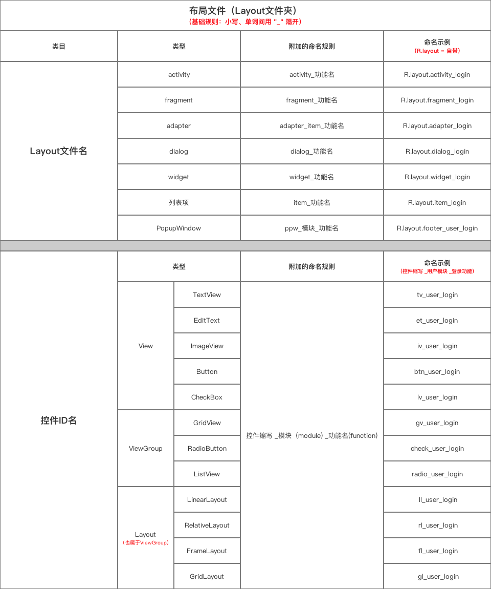
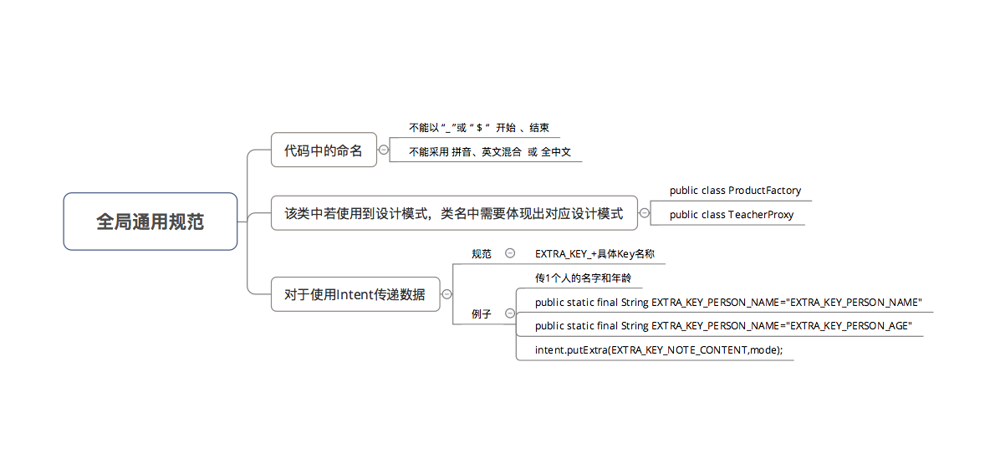

# 代码命名规范

## 前言

## 包命名规范

### 基础规则

小写、单词间连续无间隔、反域名法(分为4级)

第4级会随着功能的不同而变化。列举一些常见&需要规范的功能包名

## 类命名规范

### 基础规则

1. 类型 = 名词/名词短语
1. 形式 = 驼峰形式中的大驼峰拼写法

> 即名称中的每个词的首字母都大写

### 在具体命名时，会根据改类型的不同而附加而外的命名规则。

## 变量命名规则

### 基础变量

1. 类型 = 名词/名词短语;
1. 形式 = 驼峰形式中的小骆驼拼写法;

> 即名称中的第一个单词的首字母小写，后面的每个词的首字母大写,如`androidStudioTool`

### 在具体命名变量时，会根据改变量的类型不同而附加额外的命名规则。

## 方法命名规则

### 基础规则

1. 类型 = 动词/动词短语
1. 形式 = 小驼峰拼写法

### 具体命名时，会根据该方法名的作用不同而附加额外的命名规则

## 参数名

### 基础规则

小驼峰拼写法

### 附加命名规则:

功能名，如`userName`

## 资源

### 布局文件

### 图片资源

### 参数值资源

### 动画资源

## 额外

除了上述的命名规范以外，`Android` 中还有一些全局通用的命名规范：

# 附录

