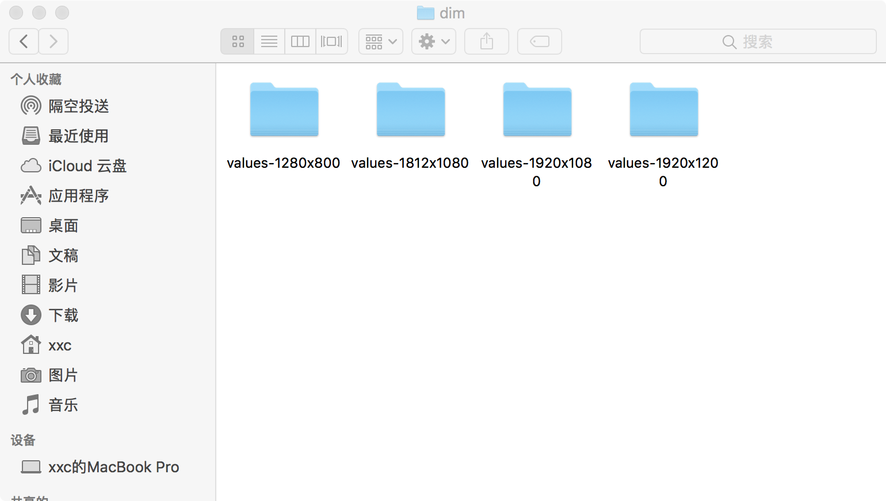

# 屏幕兼容性

## 屏幕尺寸兼容

### 1.灵活布局

### 2.备用布局

### 3.可拉伸图片(.9格式)

## 像素密度兼容

> 像素密度是屏幕上单位面积内的像素数，称为dpi(每英寸的点数)。
> 分辨率是指屏幕上像素的总数
下图便是尺寸相同但是像素密度不同的两个设备的夸大示例


### 1.不受密度限制

通过提供非密度制约像素(dp)而不是像素(px)作为测量单位

### 2.备用位图

为确保图片在所有屏幕上都能显示最佳效果，您应该提供备用位图来应对各种屏幕密度。例如，如果您的应用仅在中密度 (mdpi) 屏幕上提供位图，则在高密度屏幕上 Android 会将其放大，这样该图片在两种屏幕上会占用大致相同的物理空间。这可能会导致位图中出现明显的缩放失真。因此，您的应用应该包含更高分辨率的备用位图。

### 3.矢量图形

对于简单类型的图片（通常为图标），您可以使用矢量图形来避免为每个密度创建单独的图片。由于矢量图形使用几何线条路径（而不是像素）来定义插图，因此它们可以任意尺寸绘制而无需进行缩放。

## 不同密度兼容

### 1.使用密度无关像素

设计布局时必须避免的一个常见陷阱是，使用绝对像素来定义距离或尺寸。 使用像素来定义布局尺寸会带来问题，因为不同的屏幕具有不同的像素密度，因此同样数量的像素在不同设备上可能对应于不同的物理尺寸。 因此，在指定尺寸时，请务必使用 `dp` 或 `sp` 单位。`dp` 是一种密度无关像素，对应于 160 dpi 下像素的物理尺寸。 `sp` 是相同的基本单位，但它会按用户首选的文本尺寸进行缩放（属于缩放无关像素），因此您在定义文本尺寸时应使用此计量单位（但切勿为布局尺寸使用该单位）。

*使用wrap_content、match_parent、weight*

### 2.提供备用位图

提供能够根据各种通用密度级别（低密度、中密度、高密度和超高密度）进行定制的位图资源
如需生成这些图像，您应以矢量格式的原始资源为基础，按以下尺寸缩放比例生成每种屏幕密度对应的图像：

*   `xhdpi`：2.0
*   `hdpi`：1.5
*   `mdpi`：1.0（基准）
*   `ldpi`：0.75

这意味着，如果您为 `xhdpi` 设备生成了一幅 200x200 的图像，则应分别按 150x150、100x100 和 75x75 图像密度为 `hdpi` 设备、`mdpi` 设备和 `ldpi` 设备生成同一资源。

然后，将生成的图片文件置于 `res/` 下的相应子目录中，系统将自动根据运行您的应用的设备的屏幕密度选取正确的文件：

```text
MyProject/
  res/
    drawable-xhdpi/
        awesomeimage.png
    drawable-hdpi/
        awesomeimage.png
    drawable-mdpi/
        awesomeimage.png
    drawable-ldpi/
        awesomeimage.png
```

-----------

## 重要概念

### 屏幕尺寸

> 屏幕尺寸指屏幕的对角线的长度，单位是英寸，1英寸=2.54厘米
> 比如常见的屏幕尺寸有2.4、2.8、3.5、3.7、4.2、5.0、5.5、6.0等

### 屏幕像素密度

> 屏幕像素密度是指每英寸上的像素点数，单位是dpi，即“dot per inch”的缩写。屏幕像素密度与屏幕尺寸和屏幕分辨率有关，在单一变化条件下，屏幕尺寸越小、分辨率越高，像素密度越大，反之越小。

### dp、dip、dpi、sp、px 之间的关系

*   dip： Density independent pixels ，设备无关像素。
*   dp ：就是dip（以后别纠结dip和dp的区别了好么）
*   px ： 像素
*   dpi ：dots per inch ，一英寸多少个像素点。素密度
*   density ： 密度
*   分辨率 ： 横纵2个方向的像素点的数量
*   屏幕尺寸： 屏幕对角线的长度

dpi：每英寸点数,即屏幕上单位面积内的像素数

px : 屏幕分辨率(像素),大多数情况下，比如UI设计、Android原生API都会以px作为统一的计量单位，像是获取屏幕宽高等

dip和dp是一个意思，都是Density Independent Pixels的缩写，即密度无关像素,Android布局中常用的单位
> dp和px如何换算呢？在Android中，规定以160dpi为基准，1dip=1px，如果密度是320dpi，则1dip=2px，以此类推。
> 假如同样都是画一条320px的线，在480x800分辨率手机上显示为2/3屏幕宽度，在320x480的手机上则占满了全屏，如果使用dp为单位，在这两种分辨率下，160dp都显示为屏幕一半的长度。这也是为什么在Android开发中，写布局的时候要尽量使用dp而不是px的原因
>
> ``` java
>     /** 
>      * 根据手机的分辨率从 dp 的单位 转成为 px(像素)  。
>      */  
>     public static int dip2px(Context context, float dpValue) {
>         final float scale = context.getResources().getDisplayMetrics().density;
>         return (int) (dpValue * scale + 0.5f);
>     }
>  
>  
>     /** 
>      * 根据手机的分辨率从 px(像素) 的单位 转成为 dp 。
>      */  
>     public static int px2dip(Context context, float pxValue) {
>         final float scale = context.getResources().getDisplayMetrics().density;
>         return (int) (pxValue / scale + 0.5f);
>     }
> ```

 sp：字体大小的御用单位

> 个人理解，px是android屏幕上可显示的最小单位，这个与物理设备的显示屏有关系，一般来说，同样尺寸的屏幕（比如说都是4.7寸的手机），看起来越清晰的屏幕，其像素密度越高，以px计量的分辨率就越大。 
>  而dp与物理设备无关，只与屏幕的尺寸有关，一般来说，同样尺寸的屏幕，以dp计量的分辨率都是一样的，不管这个手机是哪个厂家生产，dp大小都一样。 
>   至于sp，其原理跟dp差不多，那为什么说sp专门用于设置字体大小呢？android手机在系统设置里面可以设置字体的大小（小、普通、大、超大），设置普通字体时，同数值dp和sp的文字看起来是一样大的，但如果设置为大字体，用dp设置大小的文字没有变化，而用sp设置大小的文字就变大了。所以说，dp与系统设置的字体大小没有关系，而sp会随系统设置的字体大小来变大或者变小。

屏幕相关的API:

```java
DisplayMetrics metric =Resources.getSystem().getDisplayMetrics()；
int DMwidth = metric.widthPixels;  // 屏幕宽度（px）
int DMheight = metric.heightPixels;  // 屏幕高度（px）
float DMdensity = metric.density;  // 屏幕密度（/ 1.0 / 1.5/ 2.0）
int DMdensityDpi = metric.densityDpi;  // 屏幕密度DPI（160 / 240/ 320）
Log.e("metric","屏幕宽度="+DMwidth+" 屏幕高度="+DMheight+" 屏幕密度="+DMdensity+" 屏幕密度DPI"+DMdensityDpi);
```

### mdpi、hdpi、xdpi、xxdpi换算?

mdpi、hdpi、xdpi、xxdpi用来修饰Android中的drawable文件夹及values文件夹，用来区分不同像素密度下的图片和dimen值。
Google官方指定按照下列标准进行区分:

| 名称     | 像素密度范围     |
| ------- | --------       |
| mdpi    | 120dpi~160dpi  |
| hdpi    | 160dpi~240dpi  |
| xhdpi   | 240dpi~320dpi  |
| xxhdpi  | 320dpi~480dpi  |
| xxxhdpi | 480dpi~640dpi  |

在设计图标时，对于五种主流的像素密度（MDPI、HDPI、XHDPI、XXHDPI 和 XXXHDPI）应按照 2:3:4:6:8 的比例进行缩放。例如，一个启动图标的尺寸为48x48 dp，这表示在 MDPI 的屏幕上其实际尺寸应为 48x48 px，在 HDPI 的屏幕上其实际大小是 MDPI 的 1.5 倍 (72x72 px)，在 XDPI 的屏幕上其实际大小是 MDPI 的 2 倍 (96x96 px)，依此类推。

虽然 Android 也支持低像素密度 (LDPI) 的屏幕，但无需为此费神，系统会自动将 HDPI 尺寸的图标缩小到 1/2 进行匹配。
下图为图标的各个屏幕密度的对应尺寸:
| 屏幕密度 |  图标尺寸|
| ------- |-------|
| mdpi    |   48x48px    |
| hdpi    |   72x72px    |
| xhdpi   |   96x96px    |
| xxhdpi  |   144x144px  |
| xxxhpi  |   192x192px  |

## 百分比适应屏幕兼容性方案:

因为分辨率不一样，所以不能用px ;因为屏幕宽度不一样，所以要小心使用dp
但可以使用此方法来统一单位，不管分辨率多大都只用一个固定的值来统计。

```java
package com.utils;

import java.io.File;
import java.io.FileNotFoundException;
import java.io.FileOutputStream;
import java.io.PrintWriter;

/**
 * Android屏幕适配Dimens文件生成工具类
 * 参考:http://blog.csdn.net/guozhaohui628/article/details/71870530
 * http://blog.csdn.net/lmj623565791/article/details/45460089
 *
 * @author LTP 2017年8月15日
 */
public class AndroidDimensUtil {

    /**
     * 基准宽度和高度(通常设置成UI图的分辨率的高度和宽度)
     */
    private static final int baseHeight = 1280;
    private static final int baseWidth = 800;

    /**
     * 生成Dimens文件的路径（项目的res文件夹）
     */
    private static String FILE_PATH;

    private static final String WidthTemplate = "<dimen name=\"x{0}\">{1}px</dimen>\n";
    private static final String HeightTemplate = "<dimen name=\"y{0}\">{1}px</dimen>\n";

    public static void main(String[] args) {
        // 获取项目res文件的路径
        getResPath(new File("").getAbsolutePath());

//        AndroidDimensUtil.createDimens(480, 320);
//        AndroidDimensUtil.createDimens(800, 480);
//        AndroidDimensUtil.createDimens(800, 600);
        AndroidDimensUtil.createDimens(854, 480);
//        AndroidDimensUtil.createDimens(854, 540);
//        AndroidDimensUtil.createDimens(960, 540);
//        AndroidDimensUtil.createDimens(960, 640);
//        AndroidDimensUtil.createDimens(1024, 600);
//        AndroidDimensUtil.createDimens(1024, 768);
//        AndroidDimensUtil.createDimens(1184, 720);
//        AndroidDimensUtil.createDimens(1196, 720);
//        AndroidDimensUtil.createDimens(1208, 720);
//        AndroidDimensUtil.createDimens(1280, 720);
//        AndroidDimensUtil.createDimens(1280, 768);
        AndroidDimensUtil.createDimens(1280, 800);
//        AndroidDimensUtil.createDimens(1334, 750);
//        AndroidDimensUtil.createDimens(1440, 900);
//        AndroidDimensUtil.createDimens(1700, 1080);
//        AndroidDimensUtil.createDimens(1776, 1080);
//        AndroidDimensUtil.createDimens(1794, 1080);
//        AndroidDimensUtil.createDimens(1800, 1080);
//        AndroidDimensUtil.createDimens(1812, 1080);
        AndroidDimensUtil.createDimens(1920, 1080);
//        AndroidDimensUtil.createDimens(1920, 1200);
//        AndroidDimensUtil.createDimens(2160, 1080);
//        AndroidDimensUtil.createDimens(2560, 1440);
//        AndroidDimensUtil.createDimens(2560, 1600);

        // 添加以上分辨率都木有通用的,参考:http://blog.csdn.net/guozhaohui628/article/details/71870530
        AndroidDimensUtil.createCommonDimens(2);
    }

    /**
     * 生成相应分辨率的文件
     *
     * @param dimenHeight 要生成相应分辨率的高
     * @param dimenWidth  要生成相应分辨率的宽
     */
    @SuppressWarnings("ResultOfMethodCallIgnored")
    private static void createDimens(int dimenHeight, int dimenWidth) {
        // 生成Height
        StringBuilder sbForHeight = new StringBuilder();
        // 生成头
        sbForHeight.append("<?xml version=\"1.0\" encoding=\"utf-8\"?>\n<resources>\n");
        // 计算倍数
        float scaleHeight = dimenHeight * 1.0f / baseHeight;
//        System.out.println("生成Height : " + dimenHeight + " , 基准Height : " + baseHeight + " , height比例 : " + scaleHeight);
        for (int i = 1; i < baseHeight; i++) {
            // 根据倍率（最终保留两位小数）生成
            sbForHeight.append(HeightTemplate.replace("{0}", i + "").replace("{1}", leftTwoDecimal(scaleHeight * i) + ""));
        }
        // 最后一个直接写成相应的高，不用计算
        sbForHeight.append(HeightTemplate.replace("{0}", baseHeight + "").replace("{1}", dimenHeight + ""));
        sbForHeight.append("</resources>");

        // 生成Width
        StringBuilder sbForWidth = new StringBuilder();
        sbForWidth.append("<?xml version=\"1.0\" encoding=\"utf-8\"?>\n<resources>\n");

        float scaleWidth = dimenWidth * 1.0f / baseWidth;
//        System.out.println("生成Width : " + dimenWidth + " , 基准Width : " + baseWidth + " , width比例 : " + scaleWidth);

        for (int i = 1; i < baseWidth; i++) {
            sbForWidth.append(WidthTemplate.replace("{0}", i + "").replace("{1}", leftTwoDecimal(scaleWidth * i) + ""));
        }
        sbForWidth.append(WidthTemplate.replace("{0}", baseWidth + "").replace("{1}", dimenWidth + ""));
        sbForWidth.append("</resources>");

        // 生成文件
        File dimenFile = new File(FILE_PATH + File.separator + "values-" + dimenHeight + "x" + dimenWidth);
        dimenFile.mkdirs();
        System.out.println("指定分辨率:" + dimenHeight + "x" + dimenWidth);

        File lay_xFile = new File(dimenFile.getAbsolutePath(), "lay_x.xml");
        File lay_yFile = new File(dimenFile.getAbsolutePath(), "lay_y.xml");

        try {
            PrintWriter printWriter = new PrintWriter(new FileOutputStream(lay_xFile));
            printWriter.print(sbForWidth.toString());
            printWriter.close();

            printWriter = new PrintWriter(new FileOutputStream(lay_yFile));
            printWriter.print(sbForHeight.toString());
            printWriter.close();
        } catch (FileNotFoundException e) {
            e.printStackTrace();
        }
    }

    /**
     * 生成适配未找到对应分辨率设备的通用dimen文件（直接放置在values中，单位为px）
     *
     * @param commonDensity 通用density的值
     */
    @SuppressWarnings("ResultOfMethodCallIgnored")
    private static void createCommonDimens(int commonDensity) {
        float commonScale = 1.0f / commonDensity;

        // 生成Height
        StringBuilder sbForHeight = new StringBuilder();
        // 生成头
        sbForHeight.append("<?xml version=\"1.0\" encoding=\"utf-8\"?>\n<resources>\n");
        for (int i = 1; i < baseHeight + 1; i++) {
            // 根据倍率（最终保留两位小数）生成
            sbForHeight.append(HeightTemplate.replace("{0}", i + "").replace("{1}", leftTwoDecimal(commonScale * i) + "").replace("px", "dp"));
        }
        sbForHeight.append("</resources>");

        // 生成Width
        StringBuilder sbForWidth = new StringBuilder();
        sbForWidth.append("<?xml version=\"1.0\" encoding=\"utf-8\"?>\n<resources>\n");

        for (int i = 1; i < baseWidth + 1; i++) {
            sbForWidth.append(WidthTemplate.replace("{0}", i + "").replace("{1}", leftTwoDecimal(commonScale * i) + "").replace("px", "dp"));
        }
        sbForWidth.append("</resources>");

        // 生成文件
        File dimenFile = new File(FILE_PATH + File.separator + "values");
        dimenFile.mkdirs();
        System.out.println("未指定的通用分辨率（values中）");

        File lay_xFile = new File(dimenFile.getAbsolutePath(), "lay_x.xml");
        File lay_yFile = new File(dimenFile.getAbsolutePath(), "lay_y.xml");

        try {
            PrintWriter printWriter = new PrintWriter(new FileOutputStream(lay_xFile));
            printWriter.print(sbForWidth.toString());
            printWriter.close();

            printWriter = new PrintWriter(new FileOutputStream(lay_yFile));
            printWriter.print(sbForHeight.toString());
            printWriter.close();
        } catch (FileNotFoundException e) {
            e.printStackTrace();
        }

    }

    /**
     * 保留两位小数
     *
     * @param a 要保留的Float数值
     * @return 保留后的数值
     */
    private static float leftTwoDecimal(float a) {
        return (int) (a * 100) / 100f;
    }

    /**
     * 利用递归查询res文件夹的绝对路径并赋值
     *
     * @param filePath 文件路径
     */
    private static void getResPath(String filePath) {
        for (File file : new File(filePath).listFiles()) {
            if (file.isDirectory()) {
                // 递归
                //这里将列出所有的文件夹
                if (file.getAbsolutePath().contains("src") && file.getAbsolutePath().contains("res")) {
                    System.out.println("res路径：" + file.getAbsolutePath());
                    FILE_PATH = file.getAbsolutePath();
                    return;
                }
                getResPath(file.getAbsolutePath());
            }
        }
    }
}
```
运行上述程序，会在指定的文件中生成制定的文件：



此方法的缺点：
对于没有生成对应分辨率文件的手机，会使用默认values文件夹，如果默认文件夹没有，就会出现问题。如果要使用这个方案，你必须尽可能多的包含所有的分辨率，因为这个是使用这个方案的基础，如果有分辨率缺少，会造成显示效果很差，甚至出错的风险，而这又势必会增加软件包的大小和维护的难度

具体可以看下这个博客：[鸿阳的博客](https://blog.csdn.net/lmj623565791/article/details/45460089)

## 最佳实践

### 关于高清设计图尺寸

Google官方给出的高清设计图尺寸有两种方案，一种是以mdpi设计，然后对应放大得到更高分辨率的图片，另外一种则是以高分辨率作为设计大小，然后按照倍数对应缩小到小分辨率的图片。但推荐使用第二种方法，因为小分辨率在生成高分辨率图片的时候，会出现像素丢失，分辨率可以以1280*720或者是1960*1080作为主要分辨率进行设计。

### ImageView的ScaleType属性

设置不同的ScaleType会得到不同的显示效果，一般情况下，设置为centerCrop能获得较好的适配效果。

### 动态设置

有一些情况下，我们需要动态的设置控件大小或者是位置，比如说popwindow的显示位置和偏移量等，这个时候我们可以动态的获取当前的屏幕属性，然后设置合适的数值

```java
public class ScreenSizeUtil {
 public static int getScreenWidth(Activity activity) { 
   return activity.getWindowManager().getDefaultDisplay().getWidth(); 
 } 
 public static int getScreenHeight(Activity activity) {
  return activity.getWindowManager().getDefaultDisplay().getHeight(); 
 }
}
```

```shell
#获取屏幕密度
adb shell wm density 
#获取屏幕分辨率
adb shell wm size
```
