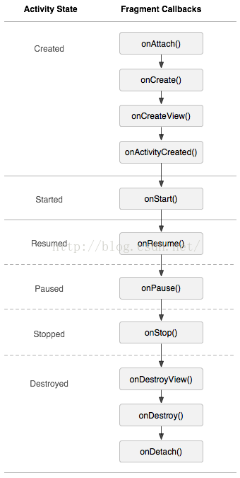
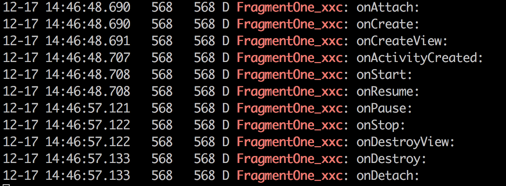

## Fragment学习

####  1.Fragment周期



log打印：



##### 周期说明

1. ###### onAttach()

   这个是回调函数
   这个时候 activity已经传进来了,获得activity的传递的值
   就可以进行 与activity的通信里
   当然也可以使用getActivity(),前提是这个fragment已经和宿主的activity关联，
   并且没有脱离
   只调用一次

2. ###### onCreate()

   系统创建fragment的时候回调他，在他里面实例化一些变量
   这些个变量主要是：当你 暂停 停止的时候 你想保持的数据
   如果我们要为fragment启动一个后台线程，可以考虑将代码放于此处。
   参数是：Bundle savedInstance, 用于保存 Fragment 参数,
   Fragement也可以重写 onSaveInstanceState(BundleoutState)方法, 
   保存Fragement状态;可以用于 文件保护

   只调用一次

3. ###### onCreateView()

   第一次使用的时候 fragment会在这上面画一个layout出来，
   为了可以画控件 要返回一个 布局的view，也可以返回null
   当系统用到fragment的时候 fragment就要返回他的view，越快越好，
   所以尽量在这里不要做耗时操作，比如从数据库加载大量数据显示listview，当然线程还是可以的。
   给当前的fragment绘制ui布局，可以使用线程更新UI,说白了就是加载fragment的布局的。

   ```java
   //一般要判断是否为空，来减少资源的消耗
   if (view == null) {
       view = inflater.inflate(R.layout.hello, null);
   }
   ```

4. ###### onActivityCteated

   当Activity中的onCreate方法执行完后调用。    
   注意了：
   从这句官方的话可以看出：当执行onActivityCreated()的时候 activity的onCreate才刚完成。
   所以在onActivityCreated()调用之前 activity的onCreate可能还没有完成，
   所以不能再onCreateView()中进行 与activity有交互的UI操作，UI交互操作可以砸onActivityCreated()里面进行。
   所以：这个方法主要是初始化那些你需要你的父Activity或者Fragment的UI已经被完整初始化才能初始化的元素。可以在此处初始化list view

5. ###### onStart()

   和activity等同 
   启动, Fragement 启动时回调, 此时Fragement可见

6. ###### onResume()

   和activity等同 
   在activity中运行是可见的激活, Fragement 进入前台, 可获取焦点时激活;

7. ###### onPause()

   和activity等同   
   其他的activity获得焦点，这个仍然可见第一次调用的时候，
   指的是 用户 离开这个fragment（并不是被销毁）
   通常用于 用户的提交（可能用户离开后不会回来了）

8. ###### onStop()

   和activity等同 
   fragment不可见的，可能情况：activity被stopped了 OR  fragment被移除但被加入到回退栈中
   一个stopped的fragment仍然是活着的如果长时间不用也会被移除

9. ###### onDestroyView()

   Fragment中的布局被移除时调用。
   表示fragemnt销毁相关联的UI布局清除所有跟视图相关的资源

   ViewPager+Fragment，由于ViewPager的缓存机制，每次都会加载3页，

   可以在此处移除view，来 解决view的重复加载问题；

   ```java
   public void onDestroyView() {
      if(view!=null){
            ((ViewGroup)view.getParent()).removeView(view);
      }
      super.onDestroyView();
   }
   ```

10. ###### onDestroy()

    销毁fragment对象时调用

11. ###### onDetach()

    与Activity解除绑定时调用


####  2.动态添加Fragment

```java
 FragmentManager fm = getSupportFragmentManager();
 FragmentTransaction transaction = fm.beginTransaction();
 if (mFragmentOne==null){
                    mFragmentOne = new FragmentOne();
    }
 if (mFragmentOne!=null&&mFragmentOne.isVisible()){
                    return;
    }
  //transaction = fm.beginTransaction();//每次开启事务时都要写，否则会报错
  transaction.add(R.id.linearlayout, mFragmentOne);
  transaction.commit();//提交后才会生效
```


#### 3.管理Fragment回退栈

```java
FragmentTransaction.addToBackStack(String)
```


#### 4.Fragment与Activity通信

在Fragment中可以通过getActivity得到当前绑定的Activity的实例，然后进行操作。

```java
Button button=getActivity().findViewById(R.id.button_add);
button.setText("hello");
```

#### 5.处理屏幕旋转问题

当屏幕发生旋转，Activity发生重新启动，默认的Activity中的Fragment也会跟着Activity重新创建；这样造成当旋转的时候，本身存在的Fragment会重新启动，然后当执行Activity的onCreate时，又会再次实例化一个新的Fragment

解决方法：在activity中的onCreate()方法中使用savedInstanceState中做判断

```java
 @Override
    public void onCreate(Bundle savedInstanceState) {
        super.onCreate(savedInstanceState);
        setContentView(R.layout.fragmentstudy_activity);
        if (savedInstanceState==null) {
            initLayouts();
        }

    }
```

#### 6.Fragment数据保存

和Activity类似，Fragment也有onSaveInstanceState的方法，在此方法中进行保存数据，然后在onCreate或者onCreateView或者onActivityCreated进行恢复都可以

#### 7.没有布局的Fragment的作用

没有布局文件Fragment实际上是为了保存，当Activity重启时，保存大量数据准备的

[Android 屏幕旋转 处理 AsyncTask 和 ProgressDialog 的最佳方案](https://blog.csdn.net/lmj623565791/article/details/37936275)
