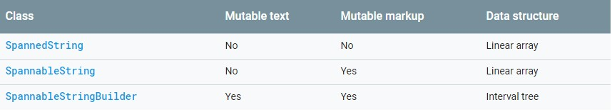
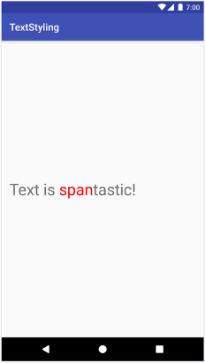
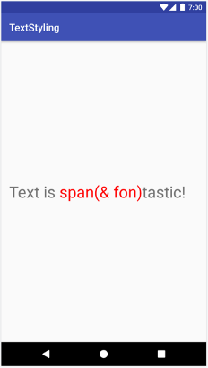
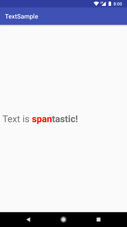
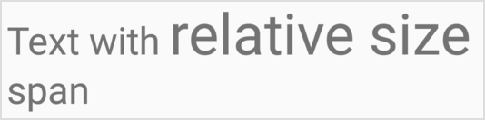
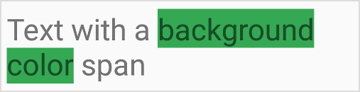

# TextView中的Spans学习

## 1. 什么是Spans?

> Spans are powerful markup objects that you can use to style text at a character or paragraph level

译文
> Spans是功能强大的标记对象，可用于在字符或段落级别设置文本样式

##  2. Spans类型

> Mutable text       可变文本
> Mutable markup     可变标记
> Data structure     数据结构

 

## 3. 如何选择使用哪种类型的Spans?

. 创建之后不会改变文本和标记,使用**SpannedString**
. 如果需要将少量范围附加到单个文本对象，并且文本本身是只读的,使用**SpannableString**
. 如果创建后需要修改文本，并且需要将跨度附加到文本，请使用**SpanNableStringBuilder**
. 如果需要将大量跨度附加到文本对象，不管文本本身是否为只读，请使用**SpanNableStringBuilder**

## 4. 例子

###### 更改文本颜色

```java
SpannableStringBuilder spannable = new SpannableStringBuilder("Text is spantastic!");
spannable.setSpan(
    new ForegroundColorSpan(Color.RED),
    8, // start
    12, // end
    Spannable.SPAN_EXCLUSIVE_INCLUSIVE
);
```



###### 添加文本

```java
SpannableStringBuilder spannable = new SpannableStringBuilder("Text is spantastic!");
spannable.setSpan(
    new ForegroundColorSpan(Color.RED),
    8, // start
    12, // end
    Spannable.SPAN_EXCLUSIVE_INCLUSIVE
);
spannable.insert(12, "(& fon)");
```



###### 加粗文本

```java
SpannableString spannable = SpannableString(“Text is spantastic!”);
spannable.setSpan(
    new ForegroundColorSpan(Color.RED),
    8, 12,
    Spannable.SPAN_EXCLUSIVE_EXCLUSIVE
);
spannable.setSpan(
    new StyleSpan(BOLD),
    8, spannable.length,
    Spannable.SPAN_EXCLUSIVE_EXCLUSIVE
);
```



###### 添加下划线

```java
SpannableString string = new SpannableString("Text with underline span");
string.setSpan(new UnderlineSpan(), 10, 19, Spanned.SPAN_EXCLUSIVE_EXCLUSIVE);
```


###### 更改文本大小

```java
SpannableString string = new SpannableString("Text with relative size span");
string.setSpan(new RelativeSizeSpan(1.5f), 10, 24, Spanned.SPAN_EXCLUSIVE_EXCLUSIVE);
```



###### 更改文本背景

```java
SpannableString string = new SpannableString("Text with a background color span");
string.setSpan(new BackgroundColorSpan(color), 12, 28, Spanned.SPAN_EXCLUSIVE_EXCLUSIVE);
```



###### 插入图片

```java
SpannableStringBuilder spannableStringBuilder=new SpannableStringBuilder("hello,this is a example");
ImageSpan imageSpan=new ImageSpan(this,R.drawable.ic_launcher_foreground);
spannableStringBuilder.setSpan(imageSpan,4,6,Spanned.SPAN_EXCLUSIVE_INCLUSIVE);
```


###### 加入点击事件

```java
SpannableStringBuilder spannableStringBuilder=new SpannableStringBuilder("hello,this is a example");
ClickableSpan clickableSpan=new ClickableSpan() {
            @Override
            public void onClick(View view) {
                Toast.makeText(MainActivity.this, "helloworld!", Toast.LENGTH_SHORT).show();
            }
};
spannableStringBuilder.setSpan(clickableSpan,0,2,Spanned.SPAN_EXCLUSIVE_INCLUSIVE);
((TextView)findViewById(R.id.textview)).setText(spannableStringBuilder);
//必须加入添加下方的方法才会触发点击事件
((TextView)findViewById(R.id.textview)).setMovementMethod(LinkMovementMethod.getInstance());
```

#####  5. 自定义Spans

```java
public class RelativeSizeColorSpan extends RelativeSizeSpan {
    private int color;
    public RelativeSizeColorSpan(float spanSize, int spanColor) {
        super(spanSize);
        color = spanColor;
    }
    @Override
    public void updateDrawState(TextPaint textPaint) {
        super.updateDrawState(textPaint);
        textPaint.setColor(color);
    }
}
```

##### 6. 详细用法

SpannableStringBuilder和SpannableString主要通过使用setSpan(Object what, int start, int end, int flags)改变文本样式

```xml
start： 指定Span的开始位置
end： 指定Span的结束位置，并不包括这个位置。
flags：取值有如下四个
Spannable. SPAN_INCLUSIVE_EXCLUSIVE：前面包括，后面不包括，即在文本前插入新的文本会应用该样式，而在文本后插入新文本不会应用该样式
Spannable. SPAN_INCLUSIVE_INCLUSIVE：前面包括，后面包括，即在文本前插入新的文本会应用该样式，而在文本后插入新文本也会应用该样式
Spannable. SPAN_EXCLUSIVE_EXCLUSIVE：前面不包括，后面不包括
Spannable. SPAN_EXCLUSIVE_INCLUSIVE：前面不包括，后面包括
what： 对应的各种Span，不同的Span对应不同的样式。已知的可用类有：
BackgroundColorSpan : 文本背景色
ForegroundColorSpan : 文本颜色
MaskFilterSpan : 修饰效果，如模糊(BlurMaskFilter)浮雕
RasterizerSpan : 光栅效果
StrikethroughSpan : 删除线
SuggestionSpan : 相当于占位符
UnderlineSpan : 下划线
AbsoluteSizeSpan : 文本字体（绝对大小）
DynamicDrawableSpan : 设置图片，基于文本基线或底部对齐。
ImageSpan : 图片
RelativeSizeSpan : 相对大小（文本字体）
ScaleXSpan : 基于x轴缩放
StyleSpan : 字体样式：粗体、斜体等
SubscriptSpan : 下标（数学公式会用到）
SuperscriptSpan : 上标（数学公式会用到）
TextAppearanceSpan : 文本外貌（包括字体、大小、样式和颜色）
TypefaceSpan : 文本字体
URLSpan : 文本超链接
ClickableSpan : 点击事件
```

##### 7. Best practices for using spans

```java
textView.setText(spannable, BufferType.SPANNABLE);
Spannable spannableText = (Spannable) textView.getText();
spannableText.setSpan(new ForegroundColorSpan(color),
                8, spannableText.getLength(),SPAN_INCLUSIVE_INCLUSIVE);
```