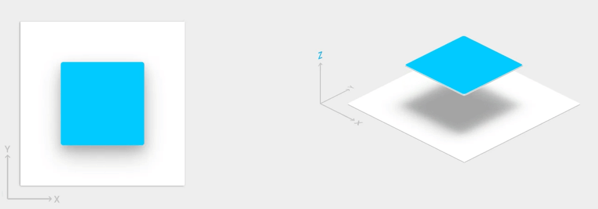

# Material Design

Material Design 是用于指导用户在各种平台和设备上进行视觉、动作和互动设计的全面指南。 要在您的 Android 应用中使用 Material Design，请遵循 [Material Design 规范](https://material.io/guidelines/)中定义的准则，并使用 [Material Design 支持库](https://developer.android.google.cn/topic/libraries/support-library/features#material-design)中提供的新组件和样式。

Android 提供了以下功能来帮助您构建 Material Design 应用：

* 一个 Material Design 应用主题背景，用于设置所有界面微件的样式
* 用于复杂数据视图的微件，例如列表和卡片
* 用于自定义阴影和动画的新 API

## Material 主题背景和微件

要充分利用各项 Material 功能（例如，为标准界面微件设置样式），以及简化应用的样式定义，请将基于 Material 的主题背景应用到您的应用中。

请参阅如何[应用 Material 主题背景](https://developer.android.google.cn/guide/topics/ui/look-and-feel/themes#MaterialTheme)。

要为用户提供熟悉的体验，请使用 Material 的最常见用户体验模式：

* 通过[浮动操作按钮](https://developer.android.google.cn/guide/topics/ui/floating-action-button) (FAB) 提升界面的主要操作。
* 使用[应用栏](https://developer.android.google.cn/training/appbar)显示您的品牌、导航、搜索和其他操作。
* 使用[抽屉式导航栏](https://developer.android.google.cn/training/implementing-navigation/nav-drawer)显示和隐藏应用的导航。
* 在应用布局和导航中使用众多其他 Material 组件之一，例如收起工具栏，标签页、底部导航栏等。要了解所有这些信息，请查看[适用于 Android 的 Material 组件目录](https://material.io/components/android/catalog/)

尽可能使用预定义 Material 图标。例如，抽屉式导航栏的导航“菜单”按钮应使用标准的“汉堡”图标。有关可用图标的列表，请参阅 [Material Design 图标](https://material.io/icons/)。您还可以使用 Android Studio 的 [Vector Asset Studio](https://developer.android.google.cn/studio/write/vector-asset-studio#importing) 从 Material 图标库中导入 SVG 图标。

## 高度阴影和卡片

除 X 和 Y 属性外，Android 中的视图还具有 Z 属性。这个新属性表示视图的高度，此高度决定了：

* 阴影的大小：视图的 Z 值越高，投射的阴影越大。
* 绘制顺序：Z 值较高的视图会显示在其他视图的顶部。

当您的布局包含卡片式布局时，通常会应用高度，这有助于您在提供 Material 样式的卡片中显示重要的信息。您可以使用 `CardView` 微件创建具有默认高度的卡片。如需了解详情，请参阅[创建卡片式布局](https://developer.android.google.cn/guide/topics/ui/layout/cardview)。

## 动画

借助新的动画 API，您可以为界面控件中的轻触反馈、视图状态更改和 Activity 转换创建自定义动画。

这些 API 的功能包括：

* 使用**轻触反馈**动画响应您的视图中的轻触事件。
* 使用**圆形揭露**动画隐藏和显示视图。
* 使用自定义 **Activity 转换**动画在 Activity 之间切换。
* 使用**曲线运动**创建更自然的动画。
* 使用**视图状态更改**动画为一个或多个视图属性的更改添加动画。
* 视图状态更改期间在**状态列表可绘制资源**中显示动画。

轻触反馈动画内置于多个标准视图中，例如按钮。借助新的 API，您可以自定义这些动画并将其添加到自定义视图中。

如需了解详情，请参阅[动画概览](https://developer.android.google.cn/training/animation/overview)。

## 可绘制资源

以下用于可绘制资源的新功能可帮助您实现 Material Design 应用：

* **矢量可绘制资源**可伸缩，不会失去定义，是单色应用内图标的理想之选。详细了解[矢量可绘制资源](https://developer.android.google.cn/guide/topics/graphics/vector-drawable-resources)。
* 通过**对可绘制资源进行着色**，您可以将位图定义为透明遮罩，并在运行时用一种颜色对其进行着色。了解如何[向可绘制资源添加色调](https://developer.android.google.cn/guide/topics/graphics/2d-graphics#DrawableTint)。
* **颜色提取**用于自动从位图图片中提取突出颜色。了解如何[使用 Palette API 选择颜色](https://developer.android.google.cn/training/material/palette-colors)。