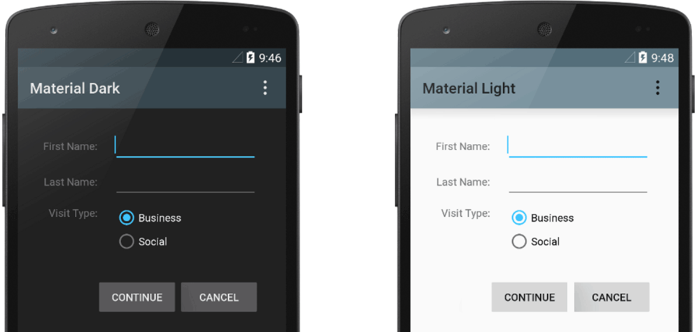
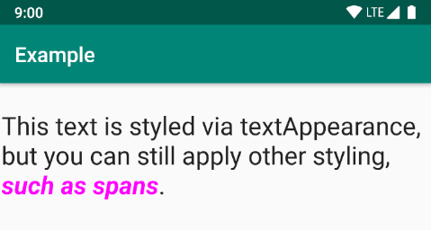

# 样式和主题

借助 Android 上的样式和主题背景，您可将应用设计的细节与界面的结构和行为分开，类似于网页设计中的样式表。

**样式是一个属性集合，用于指定单个 `View` 的外观。 样式可以指定字体颜色、字号、背景颜色等属性。**

**主题背景是一种应用于整个应用、Activity 或视图层次结构的样式，而不仅仅应用于单个视图。当您将样式作为主题背景来应用时，应用或 Activity 中的每个视图都会应用其支持的每个样式属性。主题背景还可以将样式应用于非视图元素，例如状态栏和窗口背景。**

样式和主题背景在 `res/values/` 中的[样式资源文件](https://developer.android.google.cn/guide/topics/resources/style-resource)中声明，通常命名为 `styles.xml`。



## 创建并应用样式

要创建新样式或主题背景，请打开项目的 `res/values/styles.xml` 文件。对于您想创建的每种样式，请按以下步骤操作：

1. 使用唯一标识样式的名称添加 `<style>` 元素。

1. 为您要定义的每个样式属性添加`<item>` 元素。

   每一项中的 `name` 会指定您原本会在布局中作为 XML 属性来使用的属性。`<item>` 元素中的值即为该属性的值。

例如，如果您定义以下样式：

``` xml
    <?xml version="1.0" encoding="utf-8"?>
    <resources>
        <style name="GreenText" parent="TextAppearance.AppCompat">
            <item name="android:textColor">#00FF00</item>
        </style>
    </resources>
```

您可以将样式应用到视图，如下所示：

``` xml
    <TextView
        style="@style/GreenText"
        ... />
```

只要视图接受，样式中指定的每个属性都会应用于该视图。视图只会忽略其不接受的任何属性。

> **注意**：只有添加了 `style` 属性的元素才会收到这些样式属性，任何子视图都不会应用这些样式。如果希望子视图继承样式，则应该改为应用具有 `android:theme` 属性的样式。

不过，通常不会将样式应用于各个视图，而是[将样式作为主题背景应用](https://developer.android.google.cn/guide/topics/ui/look-and-feel/themes#Theme)于整个应用、Activity 或视图集合。

## 扩展和自定义样式

创建自己的样式时，应始终扩展框架或支持库中的现有样式，以保持与平台界面样式的兼容性。要扩展样式，请使用 `parent` 属性指定要扩展的样式。然后，您可以替换继承的样式属性并添加新属性。

例如，您可以继承 Android 平台的默认文本外观，并按如下所示进行修改：

``` xml
    <style name="GreenText" parent="@android:style/TextAppearance">
        <item name="android:textColor">#00FF00</item>
    </style>
```

不过，您应始终继承 Android 支持库中的核心应用样式。为提供与 Android 4.0（API 级别 14）及更高版本的兼容性，支持库中的样式会针对每个版本中可用的界面属性优化各个样式。支持库样式的名称通常与平台样式相似，但包含 `AppCompat`。

要从库或您自己的项目继承样式，请声明父样式名称，但不带上方所示的 `@android:style/` 部分。 例如，以下示例继承了支持库中的文本外观样式：

``` xml
    <style name="GreenText" parent="TextAppearance.AppCompat">
        <item name="android:textColor">#00FF00</item>
    </style>
```

要继承样式（平台中的样式除外），您也可以使用点符号来扩展样式名称，而不是使用 `parent` 属性。也就是说，为您的样式名称添加您想继承的样式名称作为前缀，用句点分隔。这种方式通常只能用来扩展您自己的样式，而不能用来扩展其他库的样式。例如，以下样式从上方的 `GreenText` 样式继承了所有样式，然后增加了文本大小：

``` xml
    <style name="GreenText.Large">
        <item name="android:textSize">22dp</item>
    </style>
```

通过链接更多名称，您可以根据需要继续像这样继承多次样式。

>**注意**：如果使用点符号来扩展样式，并且还包含了 `parent` 属性，则父样式将替换通过点符号继承的任何样式。

要查找可使用 `<item>` 标记声明的属性，请参阅各种类应用中的“XML 属性”表格。所有视图都支持[基础 `View` 类中的 XML 属性](https://developer.android.google.cn/reference/android/view/View#lattrs)，而且许多数据视图都添加了自己的特殊属性。例如，[TextView XML 属性](https://developer.android.google.cn/reference/android/widget/TextView#lattrs)包括 [`android:inputType`](https://developer.android.google.cn/reference/android/widget/TextView#attr_android:inputType) 属性，您可以将其应用于接收输入内容的文本视图，例如 `EditText` 微件。

## 将样式作为主题背景来应用

您可以像创建样式一样创建主题背景。不同之处在于应用主题背景的方式：您不是对视图应用具有 `style` 属性的样式，而不是对 `AndroidManifest.xml` 文件中的 `<application>` 标签或 `<activity>` 标签应用具有 `android:theme` 属性的主题背景。

例如，下面演示了如何将 Android 支持库的 Material Design“深色”主题背景应用于整个应用：

``` xml
    <manifest ... >
        <application android:theme="@style/Theme.AppCompat" ... >
        </application>
    </manifest>
```

面演示了如何将“浅色”主题背景仅应用于一个 Activity：

``` xml
    <manifest ... >
        <application ... >
            <activity android:theme="@style/Theme.AppCompat.Light" ... >
            </activity>
        </application>
    </manifest>
```

现在，应用或 Activity 中的每个视图都会应用指定主题背景中定义的样式。如果视图仅支持在样式中声明的某些属性，则它仅会应用这些属性，而忽略其不支持的属性。

从 Android 5.0（API 级别 21）和 Android 支持库 v22.1 开始，您还可以在布局文件中为视图指定 `android:theme` 属性。这会修改该视图及任何子视图的主题背景，适用于更改界面特定部分中的主题背景调色板。

前面的示例展示了如何应用主题背景，例如 Android 支持库提供的 `Theme.AppCompat`。但是，您经常需要自定义主题背景来适合应用的品牌。要实现这一目的，最好的方式是对支持库中的这些样式进行扩展，并替换一些属性，如下一部分所述。

## 样式层次结构

Android 提供了多种在整个 Android 应用中设置属性的方法。例如，您可以直接在布局中设置属性，将样式应用到视图，将主题背景应用到布局，甚至以编程方式设置属性。

在选择如何为应用设置样式时，请注意 Android 的样式层次结构。一般来说，您应该尽量使用主题背景和样式，以保持一致性。如果您在多个位置指定了相同的属性，下面的列表决定了最终将应用哪些属性。该列表从最高优先级到最低优先级排序：

1. 通过文本 span 将字符或段落级样式应用到 `TextView` 派生类
1. 以编程方式应用属性
1. 将单独的属性直接应用到 View
1. 将样式应用到 View
1. 默认样式
1. 将主题背景应用于 View、Activity 或您的整个应用
1. 应用某些特定于 View 的样式，例如在 `TextView` 上设置 `TextAppearance`



> 如果您尝试设置应用样式并且没有看到预期结果，则可能是其他样式替换了您的更改。例如，如果将主题背景应用到您的应用，同时将样式应用到单个 `View`，则样式属性会替换与该 `View` 匹配的任何主题背景属性。但请注意，未被样式替换的主题背景属性仍会使用。

### TextAppearance

样式的一个局限性是您只能将一个样式应用于 `View`。但在 `TextView` 中，您也可以指定功能与样式相似的 `TextAppearance` 属性，如以下示例所示：

``` xml
    <TextView
        ...
        android:textAppearance="@android:style/TextAppearance.Material.Headline"
        android:text="This text is styled via textAppearance!" />
```

`TextAppearance` 可用于定义特定于文本的样式，同时让 `View` 的样式留作他用。但是请注意，如果直接在 `View` 上或样式中定义任何文本属性，这些值会覆盖 `TextAppearance` 值。

`TextAppearance` 支持 `TextView` 提供的一部分样式属性。有关完整的属性列表，请参阅 [TextAppearance](https://developer.android.google.cn/reference/com/google/android/material/resources/TextAppearance)。

未包含的一些常见 `TextView` 属性为 [`lineHeight[Multiplier|Extra\]`](https://developer.android.google.cn/reference/android/widget/TextView#attr_android:lineHeight)、[`lines`](https://developer.android.google.cn/reference/android/widget/TextView#attr_android:lines)、[`breakStrategy`](https://developer.android.google.cn/reference/android/widget/TextView#attr_android:breakStrategy) 和 [`hyphenationFrequency`](https://developer.android.google.cn/reference/android/widget/TextView#attr_android:hyphenationFrequency)。`TextAppearance` 作用于字符级别，而不作用于段落级别，因此不支持影响整个布局的属性。