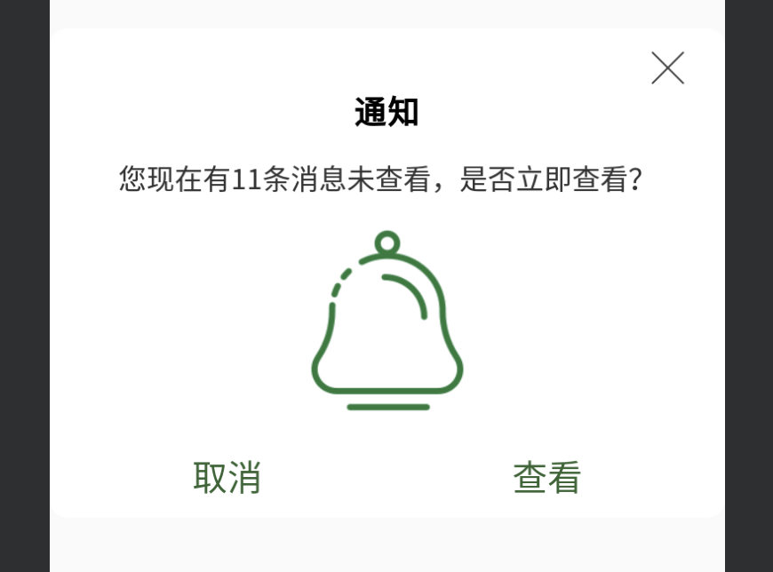

# 对话框

##  Fragment创建对话框

### 1.像创建普通的AlertDialog的方法创建FragmentDialog

```java
public class CustomeFragmentDialog extends DialogFragment {
    //重写此方法即可
    @NonNull
    @Override
    public Dialog onCreateDialog(@Nullable Bundle savedInstanceState) {

        AlertDialog.Builder builder = new AlertDialog.Builder(getActivity());
        builder.setTitle("Tips");
        builder.setMessage("你好，这是一个dialogfragment的例子!");
        builder.setPositiveButton("ok", new DialogInterface.OnClickListener() {
            @Override
            public void onClick(DialogInterface dialog, int which) {
                Toast.makeText(getActivity(), "hello", Toast.LENGTH_SHORT).show();
            }
        });
        builder.setNegativeButton("no", new DialogInterface.OnClickListener() {
            @Override
            public void onClick(DialogInterface dialog, int which) {
                dialog.dismiss();
            }
        });
        //设置点击外部不可取消
        setCancelable(false);
        return builder.create();
    }
}
```

### 2.创建自定义的dialog

custome_fragment_dialog_layout.xml

```xml
<?xml version="1.0" encoding="utf-8"?>
<LinearLayout xmlns:android="http://schemas.android.com/apk/res/android"
    xmlns:tools="http://schemas.android.com/tools"
    android:orientation="vertical"
    android:layout_width="match_parent"
    android:layout_gravity="center"
    android:background="@drawable/fragment_dialog_backgroud"
    android:layout_height="wrap_content">


    <ImageView
        android:id="@+id/colose_img"
        android:layout_width="25dp"
        android:layout_height="25dp"
        android:src="@drawable/shanchu"
        android:layout_gravity="right"
        android:layout_marginTop="10dp"
        android:layout_marginRight="20dp"
        android:visibility="visible"
        />

    <TextView
        android:id="@+id/title"
        android:layout_height="wrap_content"
        android:layout_width="wrap_content"
        android:text="通知"
        android:layout_gravity="center"
        android:gravity="center"
        android:textSize="18sp"
        android:textColor="@android:color/black"
        android:textStyle="bold"
        android:visibility="visible"
        />

    <TextView
        android:id="@+id/message"
        android:layout_height="wrap_content"
        android:layout_width="wrap_content"
        android:text="您现在有11条消息未查看，是否立即查看？"
        android:layout_gravity="center"
        android:gravity="center"
        android:textColor="#333333"
        android:textSize="16sp"
        android:layout_marginTop="15dp"
        android:visibility="visible"
        />

    <ImageView
        android:layout_marginTop="10dp"
        android:id="@+id/content_img"
        android:layout_width="120dp"
        android:layout_height="120dp"
        android:src="@drawable/notification"
        android:layout_gravity="center"
        android:layout_marginBottom="5dp"
        android:visibility="visible"
        />


    <LinearLayout
        android:id="@+id/resume_layout"
        android:layout_height="wrap_content"
        android:layout_width="match_parent"
        android:padding="10dp"
        android:orientation="horizontal"
        >

    <TextView
        android:id="@+id/cancel_textview"
        android:layout_height="wrap_content"
        android:layout_width="wrap_content"
        android:layout_gravity="center"
        android:gravity="center"
        android:text="取消"
        android:textSize="20sp"
        android:textColor="#326432"
        android:layout_weight="1"
        android:visibility="visible"
        />
        
        <TextView
            android:layout_weight="1"
            android:id="@+id/confirme_textview"
            android:layout_height="wrap_content"
            android:layout_width="wrap_content"
            android:layout_gravity="center"
            android:gravity="center"
            android:text="查看"
            android:textSize="20sp"
            android:textColor="#326432"
            android:visibility="visible"
            />
    </LinearLayout>
</LinearLayout>
```

fragment_dialog_backgroud.xml

```xml
<?xml version="1.0" encoding="utf-8"?>
<shape xmlns:android="http://schemas.android.com/apk/res/android">


    <solid
        android:color="#ffff"
        />

    <corners
        android:radius="10dp"
        />

</shape>
```


自定义布局代码：

```java
import android.app.Dialog;
import android.os.Bundle;
import android.support.annotation.NonNull;
import android.support.annotation.Nullable;
import android.support.v4.app.DialogFragment;
import android.util.DisplayMetrics;
import android.view.Gravity;
import android.view.LayoutInflater;
import android.view.View;
import android.view.ViewGroup;
import android.view.WindowManager;
import android.widget.ImageView;
import android.widget.TextView;

import com.example.xxc.studydemo.R;

public class CustomeFragmentDialog extends DialogFragment{

    private ImageView closeImage;

    private ImageView contentImage;

    private TextView titleTextView;

    private TextView messageTextView;

    private TextView confirmeTextView;

    private TextView cancelTextView;

    private int closeImageSrc = 0;

    private int contentImageSrc = 0;

    private String title;

    private String message;

    private String confirmeTxt;

    private String cancelText;

    public interface  onConfirmeClick{
        void  confirmeClickListener();
    }

    public interface  onCancelClick{
        void  cancelClickListener();
    }

    private onConfirmeClick mOnConfirmeCLick;

    private onCancelClick mOnCancelClick;


    public void setOnConfirmeCLickListener(onConfirmeClick mOnConfirmeClick){
        this.mOnConfirmeCLick = mOnConfirmeClick;
    }

    public void setOnCancelClick (onCancelClick mOnCancelClick){
        this.mOnCancelClick = mOnCancelClick;
    }

    @Override
    public void onStart() {
        super.onStart();
        //在此处设置dialog的大小
        Dialog dialog = getDialog();
        if (dialog != null) {
            DisplayMetrics dm = new DisplayMetrics();
            getActivity().getWindowManager().getDefaultDisplay().getMetrics(dm);
            WindowManager.LayoutParams attributes = dialog.getWindow().getAttributes();
            attributes.gravity = Gravity.CENTER;//对齐方式
            dialog.getWindow().setAttributes(attributes);
            dialog.getWindow().setLayout((int) (dm.widthPixels * 0.9), ViewGroup.LayoutParams.WRAP_CONTENT);
        }
        setCancelable(false);
    }

    @Override
    public void onCreate(@Nullable Bundle savedInstanceState) {
        super.onCreate(savedInstanceState);

        setStyle(DialogFragment.STYLE_NORMAL,R.style.FragmentTheme);

    }

    @Nullable
    @Override
    public View onCreateView(@NonNull LayoutInflater inflater, @Nullable ViewGroup container, @Nullable Bundle savedInstanceState) {


        View view = inflater.inflate(R.layout.custome_fragment_dialog_layout,container,false);

        closeImage = view.findViewById(R.id.colose_img);

        titleTextView = view.findViewById(R.id.title);

        messageTextView = view.findViewById(R.id.message);

        contentImage = view.findViewById(R.id.content_img);

        confirmeTextView = view.findViewById(R.id.confirme_textview);

        cancelTextView = view.findViewById(R.id.cancel_textview);

        if (closeImageSrc!=0){
            closeImage.setImageResource(closeImageSrc);
        }else {
            setViewVisible(closeImage,false);
        }

        if (contentImageSrc!=0){
            contentImage.setImageResource(contentImageSrc);
        }else {
            setViewVisible(contentImage,false);
        }

        if (title!=null){
            titleTextView.setText(title);
        }else {
            setViewVisible(titleTextView,false);
        }

        if (message!=null){
            messageTextView.setText(message);
        }else {
            setViewVisible(messageTextView,false);
        }

        if (confirmeTxt!=null){
            confirmeTextView.setText(confirmeTxt);
        }else {
            setViewVisible(confirmeTextView,false);
        }

        if (cancelText!=null){
            cancelTextView.setText(cancelText);
        }else {
            setViewVisible(cancelTextView,false);
        }

        closeImage.setOnClickListener(new View.OnClickListener() {
            @Override
            public void onClick(View v) {
                getDialog().dismiss();
            }
        });


        confirmeTextView.setOnClickListener(new View.OnClickListener() {
            @Override
            public void onClick(View v) {
                mOnConfirmeCLick.confirmeClickListener();
            }
        });

        cancelTextView.setOnClickListener(new View.OnClickListener() {
            @Override
            public void onClick(View v) {
                mOnCancelClick.cancelClickListener();
            }
        });


        return view;
    }

    public void setCloseImage(int imageSrc){

        closeImageSrc = imageSrc;

    }

    public void setTitleTextView(String pTitleTextView){

        title = pTitleTextView;

    }

    public void setMessageTextView(String message){

        this.message = message;
    }

    public void setContentImage(int imageSrc){

        contentImageSrc = imageSrc;

    }

    public void setConfirmeTextView(String pConfirmeStr){

        confirmeTxt = pConfirmeStr;
    }

    public void setCancelTextView(String pCancelStr){
        cancelText = pCancelStr;
    }

    private void setViewVisible(View mView,boolean isVisible){

        if (mView==null){
            return;
        }
        if (isVisible){
            mView.setVisibility(View.VISIBLE);
        }else {
            mView.setVisibility(View.GONE);

        }
    }

}

```

主题：

```xml
    <style name="FragmentTheme">
        <item name="android:windowBackground">@android:color/transparent</item>
        <item name="android:windowNoTitle">true</item>
    </style>
```

风格设置:

``` java
				 @Override
        public void onCreate(Bundle savedInstanceState) {
            super.onCreate(savedInstanceState);
            //1 通过样式定义
            setStyle(DialogFragment.STYLE_NORMAL,R.style.Mdialog);
            //2代码设置 无标题 无边框
            //setStyle(DialogFragment.STYLE_NO_TITLE|DialogFragment.STYLE_NO_FRAME,0);
        }
 
        @Override
        public View onCreateView(LayoutInflater inflater, ViewGroup container, Bundle savedInstanceState) {
            //3 在此处设置 无标题 对话框背景色
            //getDialog().getWindow().requestFeature(Window.FEATURE_NO_TITLE);
            // //对话框背景色
            //getDialog().getWindow().setBackgroundDrawable(new ColorDrawable(Color.RED));
            //getDialog().getWindow().setDimAmount(0.5f);//背景黑暗度
 
            //不能在此处设置style
            // setStyle(DialogFragment.STYLE_NORMAL,R.style.Mdialog);//在此处设置主题样式不起作用
            return inflater.inflate(R.layout.l_dialog_fragment,container,false);
        }
 
        @Override
        public void onStart() {
         getDialog().getWindow().getAttributes().width=getResources().getDisplayMetrics().widthPixels;
            getDialog().getWindow().setGravity(Gravity.BOTTOM);//对齐方式
            super.onStart();
        }

```

弹窗设置:

``` java
 WindowManager.LayoutParams params = window.getAttributes();
```

设置弹窗的显示位置:

``` java
params.gravity = Gravity.BOTTOM;//设置显示在底部
params.y = 55;//设置底部后,可以自行在修改它的偏移量
```

弹窗大小:

``` java
 params.width = WindowManager.LayoutParams.MATCH_PARENT;
 params.height = WindowManager.LayoutParams.WRAP_CONTENT;//这里高度设置为wrap_content,则默认是xml中设置的大小
```

完整例子:

``` java
    @Override
    public Dialog onCreateDialog(Bundle savedInstanceState) {
        if (mDialog == null) {
            mDialog = new Dialog(getActivity(), R.style.Dialog_No_Title);//设置主题
            mDialog.setCanceledOnTouchOutside(true);//设置点击外部,dialog消失
            Window window = mDialog.getWindow();
            WindowManager.LayoutParams params = window.getAttributes();
            params.gravity = Gravity.BOTTOM;//设置弹出位置
            Drawable bg = getResources().getDrawable(R.drawable.screensaver_dialog_bg);//生成drawable背景
            window.setBackgroundDrawable(bg);//设置dialog自身的背景
            params.dimAmount = 0.4f;//设置外部的透明度,0 -1 全透明 - 全黑,
            window.addFlags(WindowManager.LayoutParams.FLAG_DIM_BEHIND);//设置FLAG_DIM_BEHIND dimAmount才生效
            params.width = WindowManager.LayoutParams.MATCH_PARENT; //设置宽度
            params.height = WindowManager.LayoutParams.WRAP_CONTENT;//设置高度
            params.windowAnimations = R.style.dialogAnim;//设置动画
        }
        return mDialog;
```

在activity中调用：

```java
 //自定义dialogfragment
final CustomeFragmentDialog customeFragmentDialog = new CustomeFragmentDialog();
customeFragmentDialog.show(getSupportFragmentManager(),"dialogfragment");
customeFragmentDialog.setCloseImage(R.drawable.shanchu);
customeFragmentDialog.setTitleTextView("通知!");
customeFragmentDialog.setMessageTextView("您现在有12条信息,是否现在立即查看?");
customeFragmentDialog.setContentImage(R.drawable.notification);
customeFragmentDialog.setConfirmeTextView("查看");
customeFragmentDialog.setOnConfirmeCLickListener(new CustomeFragmentDialog.onConfirmeClick() {
                     @Override
                     public void confirmeClickListener() {
                         Toast.makeText(FragmentStudy.this, "hello",Toast.LENGTH_SHORT).show();
                         customeFragmentDialog.dismiss();
                     }
                 });
```

效果:


