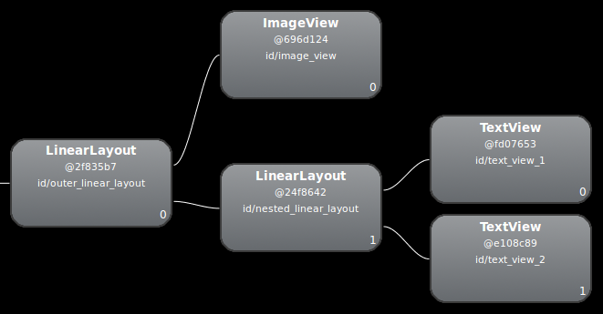
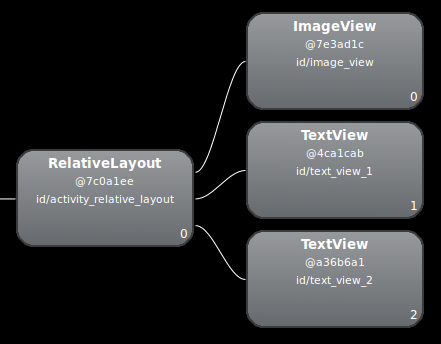

# 改善布局性能

## 优化布局层次结构

使用基本布局结构可打造最高效的布局是一种常见的误解。无论如何，您添加到应用中的每个微件和布局都需要进行初始化、布局和绘制。例如，使用 `LinearLayout` 的嵌套实例会导致视图层次结构过深。此外，嵌套多个使用 `layout_weight` 参数的 `LinearLayout` 实例成本非常高，因为每个子级都需要测量两次。如果要反复扩充布局（例如，在 `ListView` 或 `GridView` 中使用时），则要特别注意这方面。

### 检查布局

Android SDK 工具包含一个名为 [Hierarchy Viewer](https://developer.android.google.cn/studio/profile/hierarchy-viewer) 的工具，可在应用运行时分析布局。使用此工具可帮助发现布局性能方面的瓶颈。通过 Hierarchy Viewer，可以在已连接的设备或模拟器上选择正在运行的进程，然后显示布局树。各个块上的信号灯代表其测量、布局和绘制性能，有助于识别潜在问题。

如图层次布局如下：



由于上述布局性能因嵌套的 `LinearLayout` 而有所下降，因此可以通过展平布局（使布局变浅变宽，而非变窄变深）来提高性能。作为根节点的 `RelativeLayout` 允许此类布局。因此，将此设计转换为使用 `RelativeLayout` 后，该布局便会成为 2 级层次结构。检查新布局是否如下所示：



大部分差异都是由于在 `LinearLayout` 设计中使用 `layout_weight` 造成的，这会减缓测量速度。这只是如何恰当地使用每个布局的其中一个示例，您应仔细考虑是否有必要使用布局权重。

在一些复杂的布局中，系统可能会浪费时间和资源来多次测量同一个界面元素。这种现象称为 Double Taxation。如需详细了解 Double Taxation 以及如何防止出现这种情况，请参阅[性能和视图层次结构](https://developer.android.google.cn/topic/performance/rendering/optimizing-view-hierarchies)。


## 通过重复使用布局

尽管 Android 通过各种微件来提供可重复使用的小型互动元素，但您可能还需要重复使用需要特殊布局的大型组件。为了高效地重复使用完整的布局，您可以使用 `<include/>` 和 `<merge/>` 标记在当前布局中嵌入其他布局。

重复使用布局特别强大，因为它允许您创建可重复使用的复杂布局。例如，“是/否”按钮面板，或包含说明文本的自定义进度条。这也意味着您可以单独提取、管理多个布局中的任何常见应用元素，然后将其添加到各个布局中。因此，尽管您可以通过编写自定义 `View` 来创建单独的界面组件，但也可以通过重复使用布局文件来更加轻松地完成该操作。

### 创建可重复使用的布局

例如，下面的布局定义了要添加到每个 Activity 中的标题栏 (`titlebar.xml`)：

``` xml
    <FrameLayout xmlns:android="http://schemas.android.com/apk/res/android"
        xmlns:tools="http://schemas.android.com/tools"
        android:layout_width="match_parent"
        android:layout_height="wrap_content"
        android:background="@color/titlebar_bg"
        tools:showIn="@layout/activity_main" >

        <ImageView android:layout_width="wrap_content"
                   android:layout_height="wrap_content"
                   android:src="@drawable/gafricalogo" />
    </FrameLayout>
```

根 `View` 应该与您希望在添加此布局的每个布局中显示的方式完全一致。

> 上述 XML 中的 [`tools:showIn`](https://developer.android.google.cn/studio/write/tool-attributes#toolsshowin) 属性是一个特殊属性，系统会在编译过程中将其移除，并且仅在设计时在 Android Studio 中使用它 - 它指定了包含此文件的布局，因此，您可以在它出现并嵌入到其父级布局中时预览（和修改）此文件。

### 使用 <include> 标记

在要添加可重复使用的组件的布局中，添加 `<include/>` 标记。

``` xml
    <LinearLayout xmlns:android="http://schemas.android.com/apk/res/android"
        android:orientation="vertical"
        android:layout_width="match_parent"
        android:layout_height="match_parent"
        android:background="@color/app_bg"
        android:gravity="center_horizontal">

        <include layout="@layout/titlebar"/>

        <TextView android:layout_width="match_parent"
                  android:layout_height="wrap_content"
                  android:text="@string/hello"
                  android:padding="10dp" />

        ...

    </LinearLayout>
```

您还可以通过在 `<include/>` 标记中指定已添加布局的根视图的所有布局参数（任何 `android:layout_*` 属性）来替换它们。例如：

``` xml
    <include android:id="@+id/news_title"
             android:layout_width="match_parent"
             android:layout_height="match_parent"
             layout="@layout/title"/>
```

> 不过，如果您想要使用 `<include>` 标记替换布局属性，则必须同时替换 `android:layout_height` 和 `android:layout_width`，其他布局属性才能生效。

### 使用 <merge> 标记

在一个布局中包含另一个布局时，`<merge />` 标记有助于消除视图层次结构中的冗余视图组。例如，如果您的主布局是一个垂直 `LinearLayout`，其中两个连续视图可以在多个布局中重复使用，那么放置这两个视图的可重复使用布局需要有自己的根视图。不过，如果使用另一个 `LinearLayout` 作为可重复使用的布局的根，则会导致垂直 `LinearLayout` 内出现垂直 `LinearLayout`。嵌套的 `LinearLayout` 除了会降低界面的性能之外，没有任何实际用途。

为了避免包含此类冗余视图组，您可以改用 `<merge>` 元素作为可重复使用的布局的根视图。例如：

``` xml
    <merge xmlns:android="http://schemas.android.com/apk/res/android">

        <Button
            android:layout_width="fill_parent"
            android:layout_height="wrap_content"
            android:text="@string/add"/>

        <Button
            android:layout_width="fill_parent"
            android:layout_height="wrap_content"
            android:text="@string/delete"/>

    </merge>
```

现在，当您将该布局添加到其他布局中（使用 `<include/>` 标记）时，系统会忽略 `<merge>` 元素并直接在布局中放置两个按钮，以代替 `<include/>` 标记。

## 按需加载视图

有时，您的布局可能需要很少使用的复杂视图。无论是作品详情、进度指示器还是撤消消息，您都可以通过仅在需要时加载这些视图来减少内存使用量并加快渲染速度。

如果您具有应用将来可能需要的复杂视图，则可以使用延迟加载资源这项重要的方法。您可以通过为复杂且很少使用的视图定义 `ViewStub` 来实现该方法。

### 定义 ViewStub

`ViewStub` 是一种没有任何维度的轻量型视图，它不会绘制任何内容或参与布局。因此，扩充和离开视图层次结构的成本比较低。每个 `ViewStub` 只需包含 `android:layout` 属性即可指定要扩充的布局。

以下 `ViewStub` 适用于半透明进度条叠加层，只有当新的项导入应用中时，它才会显示。

``` xml
    <ViewStub
        android:id="@+id/stub_import"
        android:inflatedId="@+id/panel_import"
        android:layout="@layout/progress_overlay"
        android:layout_width="fill_parent"
        android:layout_height="wrap_content"
        android:layout_gravity="bottom" />
```

### 加载 ViewStub 布局

当您想要加载 `ViewStub` 指定的布局时，可通过调用 `setVisibility(View.VISIBLE)` 将其设为可见，或调用 `inflate()`。

```Java
    findViewById(R.id.stub_import).setVisibility(View.VISIBLE);
    // or
    View importPanel = ((ViewStub) findViewById(R.id.stub_import)).inflate();
```

> **注意**：`inflate()` 方法会在完成后返回扩充的 `View`。因此，如果您需要与布局互动，则无需调用 `findViewById()`。

该布局可见/扩充之后，`ViewStub` 元素将不再是视图层次结构的一部分。它会被替换为经过扩充的布局，该布局的根视图的 ID 便是由 ViewStub 的 `android:inflatedId` 属性指定的那个 ID。（为 `ViewStub` 指定的 ID `android:id` 仅在 `ViewStub` 布局可见/扩充之前有效。）

> **注意**：`ViewStub` 的一个缺点是它目前不支持要扩充的布局中的 `<merge>` 标记。

## 解决过度绘制问题

您可以采取以下几种策略来减少甚至消除过度绘制：

* 移除布局中不需要的背景。
* 使视图层次结构扁平化。
* 降低透明度。

### 移除布局中不需要的背景

默认情况下，布局没有背景，这表示布局本身不会直接渲染任何内容。但是，当布局具有背景时，其有可能会导致过度绘制。

移除不必要的背景可以快速提高渲染性能。不必要的背景可能永远不可见，因为它会被应用在该视图上绘制的任何其他内容完全覆盖。例如，当系统在父视图上绘制子视图时，可能会完全覆盖父视图的背景。

如需查找过度绘制的原因，请在[布局检查器](https://developer.android.google.cn/studio/debug/layout-inspector)工具中浏览层次结构。在浏览过程中，请留意您可以移除的背景，因为它们对用户不可见。在许多容器采用同一种背景颜色的情况下，您也有机会移除不需要的背景：您可以将窗口背景设置为应用的主背景颜色，并且不为其上面的任何容器定义背景值。

### 使视图层次结构扁平化

借助先进的布局设计方法，您可以轻松对视图进行堆叠和分层，从而打造出精美的设计。但是，这样做会导致过度绘制，从而降低性能，特别是在每个堆叠视图对象都是不透明的情况下，这需要将可见和不可见的像素都绘制到屏幕上。

如果遇到这类问题，您可以通过优化视图层次结构来减少重叠界面对象的数量，从而提高性能。如需详细了解如何实现此操作，请参阅[优化视图层次结构](https://developer.android.google.cn/topic/performance/optimizing-view-hierarchies)。

### 降低透明度

在屏幕上渲染透明像素，即所谓的透明度渲染，是导致过度绘制的重要因素。在普通的过度绘制中，系统会在已绘制的现有像素上绘制不透明的像素，从而将其完全遮盖，与此不同的是，透明对象需要先绘制现有的像素，以便达到正确的混合效果。诸如透明动画、淡出和阴影之类的视觉效果都会涉及某种透明度，因此有可能导致严重的过度绘制。您可以通过减少要渲染的透明对象的数量，来改善这些情况下的过度绘制。例如，如需获得灰色文本，您可以在 [`TextView`](https://developer.android.google.cn/reference/android/widget/TextView) 中绘制黑色文本，再为其设置半透明的透明度值。但是，您可以简单地通过用灰色绘制文本来获得同样的效果，而且能够大幅提升性能。

## 性能与视图层次结构

### 布局和度量性能

渲染流水线包含“布局和度量”阶段，系统在此阶段以适当的方式将相关项放置在视图层次结构中。此阶段的度量部分确定 `View` 对象的大小和边界，布局部分确定 `View` 对象在屏幕上的放置位置。

这两个流水线阶段在处理每个视图或布局时，都会产生少量开销。在大多数情况下，此开销很小，不会明显影响性能。不过，当应用添加或移除 View 对象时（例如在 `RecyclerView` 对象回收或重用 View 对象时），此开销会变大。如果 `View`对象需要考虑调整大小来保持其约束，此开销也会增加：例如，如果您的应用对包围文本的 `View` 对象调用 `SetText()`，`View` 可能需要调整大小。

如果这类操作花费的时间太长，可能会导致帧无法在允许的 16 毫秒内完成渲染，从而造成丢帧并使动画变得粗糙。

由于您无法将这些操作移至工作器线程（您的应用必须在主线程上处理这些操作），因此最好的选择是对它们进行优化，使其花费尽可能少的时间。

### 管理复杂性：布局很重要

Android [布局](https://developer.android.google.cn/guide/topics/ui/declaring-layout)允许您将界面对象嵌套在视图层次结构中。这种嵌套也会增加布局开销。当应用处理布局对象时，也会对布局的所有子对象执行相同的处理。对于复杂的布局，有时仅在系统第一次计算布局时才会产生开销。例如，当应用在 `RecyclerView` 对象中回收复杂的列表项时，系统需要列出所有对象。又如，细微的更改可以往上朝父级传播，直至到达不影响父级大小的对象为止。

布局耗时过长最常见的情况是，`View` 对象的层次结构互相嵌套。每个嵌套的布局对象都会增加布局阶段的开销。层次结构越扁平，完成布局阶段所需的时间越少。

如果使用 `RelativeLayout` 类，则可通过使用`未设权重`的嵌套 `LinearLayout` 视图，以更低的开销达到同样的效果。此外，如果您的应用面向 Android 7.0（API 级别 24）或更高版本，您可以使用特殊的布局编辑器来创建 [`ConstraintLayout`](http://tools.android.com/tech-docs/layout-editor) 对象，而非 `RelativeLayout`。这样做可以避免本节中讲到的许多问题。[`ConstraintLayout`](http://tools.android.com/tech-docs/layout-editor) 类提供类似的布局控制，但性能大大提高。该类使用自己的约束解析系统，采用与标准布局完全不同的方式来解析视图之间的关系。

### Double Taxation

例如，当您使用 `RelativeLayout` 容器时（该容器允许您根据其他 `View` 对象的位置来放置 `View` 对象），框架会执行以下操作：

1. 执行一次“布局和度量”遍历。在此过程中，框架会根据每个子对象的请求计算该子对象的位置和大小。
1. 结合此数据和对象的权重确定关联视图的恰当位置。
1. 执行第二次布局遍历，以最终确定对象的位置。
1. 进入渲染过程的下一个阶段。

视图层次结构的层次越多，潜在的性能损失就越大。

此外，`RelativeLayout` 以外的容器也可能会导致 Double Taxation。例如：

* 将 `LinearLayout` 视图设置为水平方向，可能会导致执行双重“布局和度量”遍历。如果您添加 [measureWithLargestChild](https://developer.android.google.cn/reference/android/widget/LinearLayout#attr_android:measureWithLargestChild)，则垂直方向上也可能会发生双重“布局和度量”遍历，因为在这种情况下，框架可能需要执行第二次遍历才能正确解析对象的大小。
* `GridLayout` 也有类似的问题。虽然该容器也允许相对定位，但它通常会通过预处理子视图之间的位置关系来避免 Double Taxation。不过，如果布局使用权重或使用 `Gravity` 类来填充，则会失去该预处理带来的好处，当容器为 `RelativeLayout` 时，框架可能必须执行多次遍历。

多次“布局和度量”遍历本身并不是性能负担，但如果发生在错误的地方，就可能会变成负担。应该警惕容器存在以下情况：

* 它是视图层次结构中的根元素。
* 它下面有较深的视图层次结构。
* 屏幕中填充了它的许多实例，类似于 `ListView` 对象中的子对象。

### 解决视图层次结构问题

要解决由视图层次结构引起的性能问题，其背后的基本原理很简单，但实际操作起来却比较困难。防止因视图层次结构导致性能下降包括两个目标：一个是实现视图层次结构扁平化，一个是减少“Double Taxation”。

#### 移除多余的嵌套布局

采用 merge/include

#### 采用开销较低的布局

尽量采用约束布局