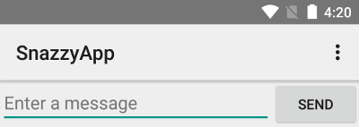
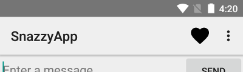

# 应用栏

## 介绍

应用栏（也称为“操作栏”）是应用 Activity 中最重要的设计元素之一，因为它为用户提供了熟悉的视觉结构和交互元素。使用应用栏可让您的应用与其他 Android 应用保持一致，从而让用户能够快速掌握如何操作您的应用并获得出色的体验。应用栏的主要功能如下：

- 一个专用区域，可以标识您的应用并指明用户在应用中的位置。
- 以可预测的方式访问搜索等重要操作。
- 支持导航和视图切换（通过标签页或下拉列表）。


## 设置应用栏

操作栏最基本的形式是在一侧显示 Activity 的标题，在另一侧显示一个溢出菜单。即便采用这种简单的形式，应用栏也能为用户提供有用的信息，并有助于赋予 Android 应用一致的观感。



从 Android 3.0（API 级别 11）开始，所有使用默认主题背景的 Activity 均使用 `ActionBar` 作为应用栏。不过，经过不同 Android 版本的演化，应用栏功能已逐渐添加到原生 `ActionBar` 中。因此，原生 `ActionBar` 的行为会有所不同，具体取决于设备使用的是哪个版本的 Android 系统。相比之下，最新功能已添加到支持库版本的 `Toolbar` 中，并且这些功能可以在任何能够使用支持库的设备上使用。

因此，您应使用支持库的 `Toolbar` 类实现 Activity 的应用栏。使用支持库的工具栏有助于确保您的应用在最大范围的设备上保持一致的行为。例如，`Toolbar` 小部件能够在搭载 Android 2.1（API 级别 7）或更高版本的设备上提供 [Material Design](https://developer.android.google.cn/design/material) 体验，但除非设备搭载的是 Android 5.0（API 级别 21）或更高版本，否则原生操作栏不会支持 Material Design。

> 版本问题要注意!

### 向 Activity 添加工具栏

1. 按照[支持库设置](https://developer.android.google.cn/tools/support-library/setup)中所述，向您的项目添加 [v7 appcompat](https://developer.android.google.cn/tools/support-library/features#v7-appcompat) 支持库。
2. 确保 Activity 可以扩展 `AppCompatActivity`：

``` java
    public class MyActivity extends AppCompatActivity {
      // ...
    }
```

> **注意**：请为您的应用中每个使用 `Toolbar` 作为应用栏的 Activity 进行此项更改。

3. 在应用清单中，将 [``](https://developer.android.google.cn/guide/topics/manifest/application-element) 元素设置为使用 appcompat 的其中一个 `NoActionBar` 主题背景。使用其中一个主题背景可以防止应用使用原生 `ActionBar` 类提供应用栏。例如：

``` xml
    <application
        android:theme="@style/Theme.AppCompat.Light.NoActionBar"
        />
```

4. 向 Activity 的布局添加一个 `Toolbar`。例如，以下布局代码会添加一个 `Toolbar`，并赋予其浮动在 Activity 之上的外观：

``` xml
       <android.support.v7.widget.Toolbar
          android:id="@+id/my_toolbar"
          android:layout_width="match_parent"
          android:layout_height="?attr/actionBarSize"
          android:background="?attr/colorPrimary"
          android:elevation="4dp"
          android:theme="@style/ThemeOverlay.AppCompat.ActionBar"
          app:popupTheme="@style/ThemeOverlay.AppCompat.Light"/>
```

 有关应用栏高度的建议，请参阅 [Material Design 规范](https://material.io/design/components/app-bars-bottom.html)。

将工具栏放在在 Activity [布局](https://developer.android.google.cn/guide/topics/ui/declaring-layout)的顶部，因为您要使用它作为应用栏。

5. 在 Activity 的 `onCreate()` 方法中，调用 Activity 的 `setSupportActionBar()` 方法，然后传递 Activity 的工具栏。此方法会将工具栏设为 Activity 的应用栏。例如：

``` java
    @Override
    protected void onCreate(Bundle savedInstanceState) {
        super.onCreate(savedInstanceState);
        setContentView(R.layout.activity_my);
        Toolbar myToolbar = (Toolbar) findViewById(R.id.my_toolbar);
        setSupportActionBar(myToolbar);
    }
```

您的应用现在有了一个基本操作栏。默认情况下，操作栏只包含应用的名称和一个溢出菜单。选项菜单最初只包含 **Settings** 菜单项。您可以按照[添加和处理操作](https://developer.android.google.cn/training/appbar/actions)中所述，向操作栏和溢出菜单添加更多操作。

### 使用应用栏实用程序方法

将工具栏设为 Activity 的应用栏后，您就可以访问 [v7 appcompat](https://developer.android.google.cn/tools/support-library/features#v7-appcompat) 支持库的 `ActionBar` 类提供的各种实用程序方法。您可以通过此方法执行许多有用的操作，例如隐藏和显示应用栏。

如需使用 `ActionBar` 实用程序方法，请调用 Activity 的 `getSupportActionBar()` 方法。此方法将返回对 appcompat `ActionBar` 对象的引用。获得该引用后，您可以调用任何 `ActionBar` 方法来调整应用栏。例如，如需隐藏应用栏，请调用 `ActionBar.hide()`。


## 添加和处理操作

您可以通过应用栏添加用户操作按钮。借助此功能，您可以将在当前上下文中最重要的操作放在应用顶部。例如，当用户查看相册时，照片浏览应用可以在顶部显示“分享”按钮和“创建影集”按钮；当用户查看单张照片时，此应用可以显示“剪裁”按钮和“滤镜”按钮。

应用栏中的空间有限。如果应用声明的操作数量过多，导致应用栏无法容纳，则应用栏会将无法容纳的操作发送到“溢出”菜单。应用还可以指定某项操作应始终显示在溢出菜单中，而不是显示在应用栏中。



### 添加操作按钮

操作溢出菜单中的所有操作按钮和其他可用项目均在 [XML 菜单资源](https://developer.android.google.cn/guide/topics/resources/menu-resource)中定义。要向操作栏添加操作，请在项目的 `res/menu/` 目录中创建一个新的 XML 文件。

为要包含在操作栏中的每项分别添加一个 [``](https://developer.android.google.cn/guide/topics/resources/menu-resource#item-element) 元素，如以下菜单 XML 文件代码示例所示：

``` xml
    <menu xmlns:android="http://schemas.android.com/apk/res/android" >

        <!-- "Mark Favorite", should appear as action button if possible -->
        <item
            android:id="@+id/action_favorite"
            android:icon="@drawable/ic_favorite_black_48dp"
            android:title="@string/action_favorite"
            app:showAsAction="ifRoom"/>

        <!-- Settings, should always be in the overflow -->
        <item android:id="@+id/action_settings"
              android:title="@string/action_settings"
              app:showAsAction="never"/>

    </menu>
```

`app:showAsAction` 属性用于指定操作是否应在应用栏中显示为按钮。如果您设置了 `app:showAsAction="ifRoom"`（例如示例代码的“收藏”操作），则只要应用栏中有足够的空间，此操作便会显示为按钮；如果空间不足，系统便会将无法容纳的操作发送到溢出菜单。如果设置了 `app:showAsAction="never"`（例如示例代码的“设置”操作），则此操作会始终列在溢出菜单中，而不会显示在应用栏中。

如果操作显示在应用栏中，则系统会使用操作的图标作为按钮。您可以在 [Material 图标](https://www.google.com/design/icons/)页面找到更多有用的图标。

> orderInCategory
>  设置菜单项的排列顺序，必须设置大于等于0的整数值。数值小的排列在前，如果值相等，则按照xml中的顺序展现。
>
> title
>  菜单项的标题。
>
> icon
>  菜单项的图标。
>
> showAsAction
>  该属性有五个值，可以混合使用。
>
> - always
>    总是显示在Toolbar上。
> - ifRoom
>    如果Toolbar上还有空间，则显示，否则会隐藏在溢出列表中。
> - never
>    永远不会显示在Toolbar上，只会在溢出列表中出现。
> - withText
>    文字和图标一起显示。
> - collapseActionView
>    声明了这个操作视窗应该被折叠到一个按钮中，当用户选择这个按钮时，这个操作视窗展开。一般要配合ifRoom一起使用才会有效.

### 响应操作

当用户选择应用栏中的某个项目时，系统会调用您 Activity 的 `onOptionsItemSelected()` 回调方法，并传递 `MenuItem` 对象以指示用户点击的是哪个项目。在您的 `onOptionsItemSelected()` 实现中，调用 `MenuItem.getItemId()` 方法可确定按下的是哪个项目。返回的 ID 与您在相应 [``](https://developer.android.google.cn/guide/topics/resources/menu-resource#item-element) 元素的 `android:id` 属性中声明的值相匹配。

例如，以下代码可以检查用户选择的是哪项操作。如果此方法无法识别用户的操作，则会调用父类方法：

``` java
 	@Override
    public boolean onCreateOptionsMenu(Menu menu) {
        getMenuInflater().inflate(R.menu.actionbar_menu,menu);
        return true;
    }   

	@Override
    public boolean onOptionsItemSelected(MenuItem item) {
        switch (item.getItemId()) {
            case R.id.action_settings:
                // User chose the "Settings" item, show the app settings UI...
                return true;

            case R.id.action_favorite:
                // User chose the "Favorite" action, mark the current item
                // as a favorite...
                return true;

            default:
                // If we got here, the user's action was not recognized.
                // Invoke the superclass to handle it.
                return super.onOptionsItemSelected(item);
        }
    }
```

> Toolbar作为独立控件添加菜单:
>
> ``` java
> toolbar.inflateMenu(R.menu.actionbar_menu);
>         toolbar.setOnMenuItemClickListener(new Toolbar.OnMenuItemClickListener() {
>             @Override
>             public boolean onMenuItemClick(MenuItem item) {
>                 return false;
>             }
>         });
> ```

## 添加向上操作

应用应该让用户能够轻松地返回应用主屏幕。要实现此目的，最简单的方法是针对除主 Activity 以外的所有 Activity 在应用栏中分别提供一个“向上”按钮。当用户选择“向上”按钮时，应用便会转到父 Activity。

### 声明父 Activity

要在 Activity 中支持向上功能，您需要声明 Activity 的父级。为此，您可以在应用清单中设置 `android:parentActivityName` 属性。

`android:parentActivityName` 属性是在 Android 4.1（API 级别 16）中引入的。要支持搭载旧版 Android 的设备，请定义一个 [``](https://developer.android.google.cn/guide/topics/manifest/meta-data-element) 名称值对，其中名称为 `"android.support.PARENT_ACTIVITY"`，值为父 Activity 的名称。

例如，假设应用有一个名为 `MainActivity` 的主 Activity 和一个子 Activity。以下清单代码声明了这两个 Activity，并指定了父/子关系：

``` xml
    <application ... >
        ...

        <!-- The main/home activity (it has no parent activity) -->

        <activity
            android:name="com.example.myfirstapp.MainActivity" ...>
            ...
        </activity>

        <!-- A child of the main activity -->
        <activity
            android:name="com.example.myfirstapp.MyChildActivity"
            android:label="@string/title_activity_child"
            android:parentActivityName="com.example.myfirstapp.MainActivity" >

            <!-- Parent activity meta-data to support 4.0 and lower -->
            <meta-data
                android:name="android.support.PARENT_ACTIVITY"
                android:value="com.example.myfirstapp.MainActivity" />
        </activity>
    </application>
```

### 启用“向上”按钮

要为具有父 Activity 的 Activity 启用“向上”按钮，请调用应用栏的 `setDisplayHomeAsUpEnabled()` 方法。通常，您需要在创建 Activity 时调用此方法。例如，以下 `onCreate()` 方法将 `Toolbar` 设为 `MyChildActivity` 的应用栏，然后启用此应用栏的“向上”按钮：

``` java
    @Override
    protected void onCreate(Bundle savedInstanceState) {
        super.onCreate(savedInstanceState);
        setContentView(R.layout.activity_my_child);

        // my_child_toolbar is defined in the layout file
        Toolbar myChildToolbar =
            (Toolbar) findViewById(R.id.my_child_toolbar);
        setSupportActionBar(myChildToolbar);

        // Get a support ActionBar corresponding to this toolbar
        ActionBar ab = getSupportActionBar();

        // Enable the Up button
        ab.setDisplayHomeAsUpEnabled(true);
    }
```

> 并不需要在 Activity 的 `onOptionsItemSelected()` 方法中捕获向上操作。此方法应该调用其父类，如[响应操作](https://developer.android.google.cn/training/appbar/actions#handle-actions)中所示。此父类方法会根据应用清单的规定，通过导航到父 Activity 来响应“向上”操作。