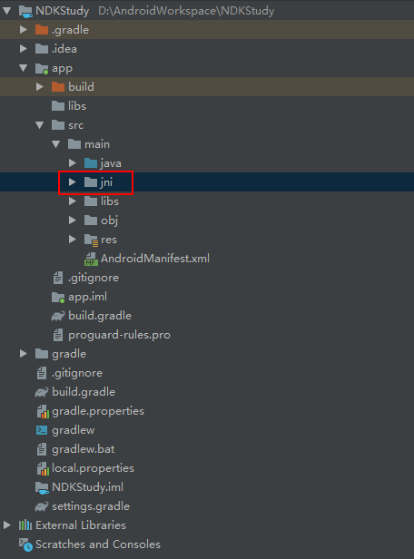
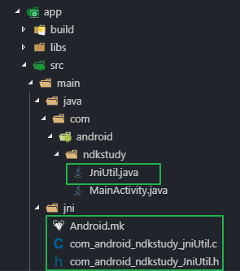
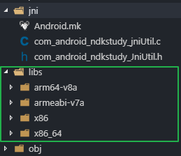

# Android使用NDK

使用命令行编译生成so文件

## 一.创建目录

如图所示,创建jni目录




## 二.在java文件夹中创建java文件

例子: JniUtil.java

```java

package com.android.ndkstudy;

public class JniUtil {

    public native String test();

}

```

然后再`Build\Make Project`中生成class文件


## 三.生成.h文件

在`src\main`目录下输入此命令

``` shell
javah -classpath "D:\AndroidWorkspace\NDKStudy\app\build\intermediates\javac\debug\classes" -jni com.android.ndkstudy.JniUtil
```

> 1. javah -classpath "绝对路径" -jni "报名+文件名(没有class)"

>2. 由于javah以后生成的.h文件需要包名+类名，所以必须在包括全包名的目录下执行javah命令，也就是项目\src\main在或者项目\bin\classe\下执行 javah 包名.类名的命令，

生成的文件`com_android_ndkstudy_JniUtil.h`

``` h
/* DO NOT EDIT THIS FILE - it is machine generated */
#include <jni.h>
/* Header for class com_android_ndkstudy_JniUtil */

#ifndef _Included_com_android_ndkstudy_JniUtil
#define _Included_com_android_ndkstudy_JniUtil
#ifdef __cplusplus
extern "C" {
#endif
/*
 * Class:     com_android_ndkstudy_JniUtil
 * Method:    test
 * Signature: ()Ljava/lang/String;
 */
JNIEXPORT jstring JNICALL Java_com_android_ndkstudy_JniUtil_test
  (JNIEnv *, jobject);

#ifdef __cplusplus
}
#endif
#endif
```

## 四.生成so文件



### 1. 将生成的.h文件放入到jni目录中

### 2. 添加C语言源文件

com_android_ndkstudy_JniUtil.c

``` c

#include "com_android_ndkstudy_JniUtil.h"

JNIEXPORT jstring JNICALL Java_com_android_ndkstudy_JniUtil_test
  (JNIEnv * env, jobject obj)
  {
      return (*env)->NewStringUTF(env,"This is implment by c");
  };

```


### 3. 添加`Android.mk`文件

``` mk
LOCAL_PATH := $(call my-dir)
include $(CLEAR_VARS)
LOCAL_MODULE    := testJni
LOCAL_SRC_FILES := com_android_ndkstudy_jniUtil.c
include $(BUILD_SHARED_LIBRARY)
```

>1. LOCAL_SRC_FILES := com_android_ndkstudy_jniUtil.c 代表要编译的c语言文件

>2. LOCAL_MODULE    := testJni 代表生成的so文件名,会自动添加lib前缀

>3. clude $(BUILD_SHARED_LIBRARY) 代表编译共享库


### 4. ndk编译

``` shell
ndk-build
```

编译完成之后会`src\main`目录中生成`libs`和`obj`目录



## 五. Android项目中使用

### 1.打开`app\build.gradle`文件,添加如下代码:

``` gradle
android {
    ...
     sourceSets.main {
        jni.srcDirs = []
        jniLibs.srcDir 'src/main/libs'
    }
}
```

### 2.打开`java\android\ndkstudy\JniUtil.java`文件,添加如下代码:

``` java
package com.android.ndkstudy;

public class JniUtil {

    //添加的代码 testJni(so文件-去掉lib前缀,并不带so)
    static {
        System.loadLibrary("testJni");
    }

    public native String test();

}
```

### 3.java代码调用

``` java
JniUtil jniUtil = new JniUtil();
Toast.makeText(MainActivity.this, "-->"+jniUtil.test(),Toast.LENGTH_SHORT).show();
```

