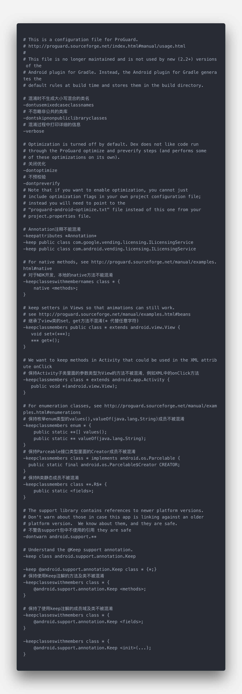
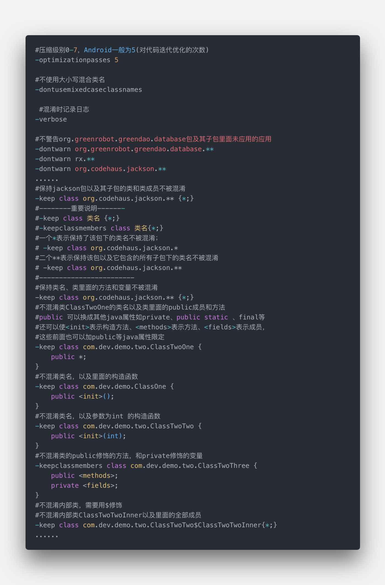

# 混淆学习

## 0. 为什么需要混淆

作为Android开发者，如果你不想开源你的应用，那么在应用发布前，就需要对代码进行混淆处理，从而让我们代码即使被反编译，也难以阅读;

混淆的作用:

【优化】它能优化java的字节码，使程序运行更快；
【压缩】最直观的就是减少App大小，在混淆过程中它会找出未被使用过的类和类成员并删除他们；
【混淆】使java代码中的类、函数、变量名随机变成无意义的代号形如：a,b,c...之类，增加了阅读的困难程度;

> 上面这几个功能都是默认打开的，要关闭他们只需配置规则：

``` text
-dontshrink    :关闭压缩;
-dontoptimize  :关闭优化;
-dontobfuscate :关闭混淆;
```

## 1. 混淆准备

* 新建一个Android 项目时，会自动生成两个文件proguard-project.txt ，  project.properties;
* 只需要将project.properties文件中  proguard.config=${sdk.dir}/tools/proguard/proguard-android.txt:proguard-project.txt 这行前面的#去掉

**如下图所示：**


**注意⚠️**

> 1. 只能通过export signed  Application Package  或者 export  Unsigned  Application Package这两种方式打包apk，才有代码混淆，直接运行的apk没有代码混淆的。

> 2. proguard.config=${sdk.dir}/tools/proguard/proguard-android.txt:proguard-project.txt，这行代码中用到了两个配置文件，一个是sdk目录下的**proguard-android.txt**，一些基本的配置，比如 Activity ，注解 ，实现接口等不被混淆**一般不用修改**。另一个是**proguard-project.txt**，之前说的新建项目自动生成的文件，这里你需要加上一些你需要不被混淆的配置。

## 2. 混淆规则

1. Android默认的规则解析



**上面默认的规则中指示了些需要保持不能别混淆的代码，包括：**

1. 继承至Android组件（Activity, Service...）的类。
2. 自定义控件，继承至View的类（被xml文件引用到的，名字已经固定了的）
3. enum 枚举
4. 实现了 android.os.Parcelable 接口的
5. Android R文件
6. 数据库驱动...
7. Android support 包等
8. Android 的注释不能混淆
  > -keepattributes *Annotation*
9. 对于NDK开发 本地的native方法不能被混淆
  > -keepclasseswithmembernames class * { native <methods>; }

2. 规则说明（自定义混淆规则）



> 参考 [Android代码混淆入门](https://www.jianshu.com/p/86ee6ef970ef)

3. 基本规则([参考来源](https://www.jianshu.com/p/7436a1a32891))

* -keepattributes {name}  保护给定的属性不被混淆
  如:`-keepattributes *Annotation*`

* -dontwarn {name}  不要警告指定库中找不到的引用。混淆在默认情况下会检查每个库的引用是否正确，但是有些第三方库里面会有用不到的类，有些没有正确引用，所以需要对第三方库取消警告 否则会报错，而且有可能混淆时间会很长。
  如:`-dontwarn android.support.**`

* -keep {Modifier} {class_specification}  保留指定的类名、类成员不被混淆

* -keepclassmembers {modifier} {class_specification}   保留指定的类成员不被混淆

* -keepclasseswithmembers {class_specification}   保留指定的类名、类成员不被混淆

* -keepnames {class_specification}   保留指定的类名、类成员的名称不被混淆

* -keepclasseswithmembernames {class_specification}   保留指定的类名、类成员名称不被混淆（如果存在的话）

* 最常用的命令 keep

``` java
-keep class cn.hadcn.test.**
-keep class cn.hadcn.test.*
```

一颗星表示只是保持该包下的类名，而子包下的类名还是被混淆；两颗星表示把本包和所含子包下的类名都保持；
以上的两个方法会保持类名，但是里面的具体方法及变量名还是被混淆了，如果即想保持包名又想保持里面的内容不被混淆，需要以下方法：

`-keep class cn.hadcn.test.* {*;}`

在此基础上，可以使用Java的语法规则保护特定的类不被混淆，例如：

`-keep public class * extends android.app.Activity`

如果我们要保留一个类中的内部类不被混淆则需要用$符号，如下例子表示保持ScriptFragment内部类JavaScriptInterface中的所有public内容不被混淆。

``` java
-keepclassmembers class cc.ninty.chat.ui.fragment.ScriptFragment$JavaScriptInterface {
   public *;
}
```

如果希望保护类中的某些特定的方法不被混淆，则需要使用：

``` java
<init>;     //匹配所有构造器
<fields>;    //匹配所有域
<methods>;  //匹配所有方法方法
```

还可以在<fields>或<methods>前面加上private 、public、native等来进一步指定不被混淆的内容，如：

```java
-keep class cn.hadcn.test.One {
    public <methods>;
}
```
表示One类下的所有public方法都不会被混淆，当然你还可以加入参数，比如以下表示用JSONObject作为入参的构造函数不会被混淆

```java
-keep class cn.hadcn.test.One {
   public <init>(org.json.JSONObject);
}
```

有时候不需要保持类名，只需要把该类下的特定方法保持不被混淆就好，那就不能用keep方法了，keep方法会保持类名，而需要用keepclassmembers ，如此类名就不会被保持，为了便于对这些规则进行理解，官网给出了以下表格:

保留	| 防止被移除或者被重命名 |	防止被重命名
:-:|:-:|:-:|
类和类成员|	-keep	|-keepnames
仅类成员	|-keepclassmembers|	-keepclassmembernames
如果拥有某成员，保留类和类成员|	-keepclasseswithmembers	|-keepclasseswithmembernames


## 3.注意事项📋

1. jni方法不可以混淆，因为这个方法需要和native方法保持一致

```java
-keepclasseswithmembernames class * { # 保持native方法不被混淆    
    native <methods>;
}
```

2. 反射用到的类不混淆(否则反射找不到正确的方法)

3. AndroidMainfest中的类不混淆，所以四大组件和Application的子类和Framework层下所有的类默认不会进行混淆;自定义的View默认也不会被混淆.

4. 与服务端交互时，使用GSON、fastjson等框架解析服务端数据时，所写的JSON对象类不混淆，否则无法将JSON解析成对应的对象；

5. 使用第三方开源库或者引用其他第三方的SDK包时，如果有特别要求，也需要在混淆文件中加入对应的混淆规则；

6. 有用到WebView的JS调用也需要保证写的接口方法不混淆，原因和第一条一样；

7. Parcelable的子类和Creator静态成员变量不混淆，否则会产生Android.os.BadParcelableException异常；

```java
-keep class * implements Android.os.Parcelable { # 保持Parcelable不被混淆           
    public static final Android.os.Parcelable$Creator *;
}
```

8. 使用enum类型时需要注意避免以下两个方法混淆，因为enum类的特殊性，以下两个方法会被反射调用，见第二条规则.

```java
-keepclassmembers enum * {  
    public static **[] values();  
    public static ** valueOf(java.lang.String);  
}
```