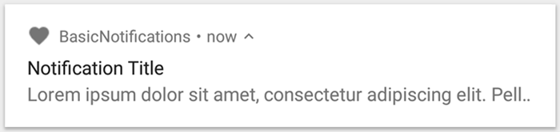

# Notification学习
## 1. 官网说明

通知是您可以在应用的常规 UI 外部向用户显示的消息。当您告知系统发出通知时，它将先以图标的形式显示在通知区域中。用户可以打开抽屉式通知栏查看通知的详细信息。 通知区域和抽屉式通知栏均是由系统控制的区域，用户可以随时查看。 

>[Notifications provide short, timely information about events in your app while it's not in use.](https://developer.android.com/training/notify-user/build-notification)


## 2.创建通知
您可以在 NotificationCompat.Builder 对象中为通知指定 UI 信息和操作。要创建通知，请调用 NotificationCompat.Builder.build()，它将返回包含您的具体规范的 Notification 对象。要发出通知，请通过调用 NotificationManager.notify() 将 Notification 对象传递给系统。

**必需的通知内容**

Notification 对象必须包含以下内容：

    小图标，由setSmallIcon() 设置
    标题，由setContentTitle() 设置
    详细文本，由setContentText() 设置



例子：
```java
NotificationManager notificationManager = getSystemService(NotificationManager.class);
//8.0后要加入渠道组
if (Build.VERSION.SDK_INT >= Build.VERSION_CODES.O) {
        CharSequence name = getString(R.string.channel_name);
        String description = getString(R.string.channel_description);
        int importance = NotificationManager.IMPORTANCE_DEFAULT;
        NotificationChannel channel = new NotificationChannel(CHANNEL_ID, name, importance);
        channel.setDescription(description);
        // Register the channel with the system; you can't change the importance
        // or other notification behaviors after this
        notificationManager.createNotificationChannel(channel);
    }
 //CHANNEL_ID 随意，也可以用channel.getId()方法获取
NotificationCompat.Builder mBuilder = new NotificationCompat.Builder(this, CHANNEL_ID)
        .setSmallIcon(R.drawable.notification_icon)
        .setContentTitle(textTitle)
        .setContentText(textContent)
        .setPriority(NotificationCompat.PRIORITY_DEFAULT);
 //显示通知，id随意但是要记住       
 notificationManager.notify(1,notificationBuilder.build());       
```
***notification ID 注意点***
> Remember to save the notification ID that you pass to NotificationManagerCompat.notify() because you'll need it later if you want to update or remove the notification.

## 3.设置点击事件
```java
// Create an explicit intent for an Activity in your app
Intent intent = new Intent(this, AlertDetails.class);
intent.setFlags(Intent.FLAG_ACTIVITY_NEW_TASK | Intent.FLAG_ACTIVITY_CLEAR_TASK);
PendingIntent pendingIntent = PendingIntent.getActivity(this, 0, intent, 0);

NotificationCompat.Builder mBuilder = new NotificationCompat.Builder(this, CHANNEL_ID)
        .setSmallIcon(R.drawable.notification_icon)
        .setContentTitle("My notification")
        .setContentText("Hello World!")
       	//通知优先级
        .setPriority(NotificationCompat.PRIORITY_DEFAULT)
        // Set the intent that will fire when the user taps the notification
        .setContentIntent(pendingIntent)
        //点击后通知消失
        .setAutoCancel(true);
```
添加动作点击按钮
```java
Intent snoozeIntent = new Intent(this, MyBroadcastReceiver.class);
snoozeIntent.setAction(ACTION_SNOOZE);
snoozeIntent.putExtra(EXTRA_NOTIFICATION_ID, 0);
PendingIntent snoozePendingIntent =
        PendingIntent.getBroadcast(this, 0, snoozeIntent, 0);

NotificationCompat.Builder mBuilder = new NotificationCompat.Builder(this, CHANNEL_ID)
        .setSmallIcon(R.drawable.notification_icon)
        .setContentTitle("My notification")
        .setContentText("Hello World!")
        .setPriority(NotificationCompat.PRIORITY_DEFAULT)
        .setContentIntent(pendingIntent)
        //重要的是这一句 按钮图片,按钮文本,按钮响应事件
        .addAction(R.drawable.ic_snooze, getString(R.string.snooze),
                snoozePendingIntent);
```

通知优先级：

* Notification.PRIORITY_MAX 	 重要而紧急的通知，通知用户这个事件是时间上紧迫的或者需要立即处理的。
* Notification.PRIORITY_HIGH 	 高优先级用于重要的通信内容，例如短消息或者聊天，这些都是对用户来说比较有兴趣的
* Notification.PRIORITY_DEFAULT 	默认优先级用于没有特殊优先级分类的通知
* Notification.PRIORITY_LOW 	低优先级可以通知用户但又不是很紧急的事件。只显示状态栏图标
* Notification.PRIORITY_MIN 	用于后台消息 (例如天气或者位置信息)。只有用户下拉通知抽屉才能看到内容
## 4.添加progress bar
```java
...
NotificationManagerCompat notificationManager = NotificationManagerCompat.from(this);
NotificationCompat.Builder mBuilder = new NotificationCompat.Builder(this, CHANNEL_ID);
mBuilder.setContentTitle("Picture Download")
        .setContentText("Download in progress")
        .setSmallIcon(R.drawable.ic_notification)
        .setPriority(NotificationCompat.PRIORITY_LOW);

// Issue the initial notification with zero progress
int PROGRESS_MAX = 100;
int PROGRESS_CURRENT = 0;
mBuilder.setProgress(PROGRESS_MAX, PROGRESS_CURRENT, false);
notificationManager.notify(notificationId, mBuilder.build());

// Do the job here that tracks the progress.
// Usually, this should be in a 
// worker thread 
// To show progress, update PROGRESS_CURRENT and update the notification with:
// mBuilder.setProgress(PROGRESS_MAX, PROGRESS_CURRENT, false);
// notificationManager.notify(notificationId, mBuilder.build());

// When done, update the notification one more time to remove the progress bar
mBuilder.setContentText("Download complete")
        .setProgress(100,i,false);
notificationManager.notify(notificationId, mBuilder.build());
```


## 5.清除所有的通知
 Notifications remain visible until one of the following happens:

     1. The user dismisses the notification.
     2. The user clicks the notification, and you called setAutoCancel() when you created the notification.
     3. You call cancel() for a specific notification ID. This method also deletes ongoing notifications.
     4. You call cancelAll(), which removes all of the notifications you previously issued.
     If you set a timeout when creating a notification using setTimeoutAfter(), the system cancels the notification after the specified duration elapses. If required, you can cancel a notification before the specified timeout duration elapses.

```java
NotificationManager manager = (NotificationManager) mContext.getSystemService(Context.NOTIFICATION_SERVICE); 
// 取消notifyId关联的通知 
manager.cancel(notifyId); 
// 取消所有通知 
manager.cancelAll();
```
## 6.设置锁定屏幕可见性
To control the level of detail visible in the notification from the lock screen, call setVisibility() and specify one of the following values:

    VISIBILITY_PUBLIC shows the notification's full content.
    VISIBILITY_SECRET doesn't show any part of this notification on the lock screen.
    VISIBILITY_PRIVATE shows basic information, such as the notification's icon and the content title, but hides the notification's full content.

When **VISIBILITY_PRIVATE** is set, you can also provide an alternate version of the notification content which hides certain details. For example, an SMS app might display a notification that shows You have 3 new text messages, but hides the message contents and senders. To provide this alternative notification, first create the alternative notification with **NotificationCompat.Builder** as usual. Then attach the alternative notification to the normal notification with setPublicVersion().

However, the user always has final control over whether their notifications are visible on the lock screen and can even control that based on your app's notification channels.

## 7.提醒通知到达
提供了 铃声/振动/呼吸灯 三种提醒方式，可以使用一种或同时使用多种

使用默认提醒

* Notification.DEFAULT_SOUND 	添加默认声音提醒
* Notification.DEFAULT_VIBRATE 	添加默认震动提醒
* Notification.DEFAULT_LIGHTS 	添加默认呼吸灯提醒
* Notification.DEFAULT_ALL 	同时添加以上三种默认提醒

```java
// 添加默认声音提醒 
builder.setDefaults(Notification.DEFAULT_SOUND);  
// 添加默认呼吸灯提醒，自动添加FLAG_SHOW_LIGHTS 
builder.setDefaults(Notification.DEFAULT_LIGHTS);
```
添加自定义提醒

```java
//添加自定义声音提醒 
builder.setSound(Uri.parse("path/to/sound")); 
// 添加自定义震动提醒 
// 延迟200ms后震动300ms，再延迟400ms后震动500ms 
long[] pattern = new long[]{200,300,400,500}; 
builder.setVibrate(pattern); 
// 添加自定义呼吸灯提醒，自动添加FLAG_SHOW_LIGHTS 
int argb = 0xffff0000;  // led灯光颜色 
int onMs = 300;			// led亮灯持续时间 
int offMs = 100; 		// led熄灯持续时间 
builder.setLights(argb, onMs, offMs);
```

## 8. 保留 Activity 返回栈
常规 Activity

默认情况下，从通知启动一个Activity，按返回键会回到主屏幕。

但某些时候有按返回键仍然留在当前应用的需求，这就要用到TaskStackBuilder了。

1、在manifest中定义Activity的关系

```xml
<activity
    android:name=".ResultActivity"
    android:parentActivityName=".MainActivity">
</activity>
```
2、构建带返回栈的PendingIntent并发送通知
```java
// 构建返回栈 
TaskStackBuilder tsb = TaskStackBuilder.create(this);
tsb.addParentStack(ResultActivity.class);
tsb.addNextIntent(new Intent(this, ResultActivity.class));
// 构建包含返回栈的 PendingIntent 
PendingIntent pi = tsb.getPendingIntent(0, PendingIntent.FLAG_UPDATE_CURRENT);
// 构建通知 
NotificationCompat.Builder builder = new NotificationCompat.Builder(this); ... builder.setContentIntent(pi); 
// 发送通知
NotificationManager manager = (NotificationManager) getSystemService(Context.NOTIFICATION_SERVICE);
manager.notify(notifyId, builder.build());
```
---
## 9. 特殊Activity

默认情况下，从通知启动的Activity会在近期任务列表里出现。

如果不需要在近期任务里显示，则需要做以下操作:

1、在manifest中定义Activity
```xml
<activity
android:name=".ResultActivity" 
android:launchMode="singleTask" 
android:taskAffinity=""
android:excludeFromRecents="true"> 
</activity>
```
2、构建PendingIntent并发送通知
```java
// 创建 Intent 
Intent intent = new Intent(this, ResultActivity.class);
intent.setFlags(Intent.FLAG_ACTIVITY_NEW_TASK | Intent.FLAG_ACTIVITY_CLEAR_TASK); 
// 创建 PendingIntent 
PendingIntent pi = PendingIntent.getActivity(this, 0, intent, PendingIntent.FLAG_UPDATE_CURRENT); 
// 构建通知 
NotificationCompat.Builder builder = new NotificationCompat.Builder(this); 
... builder.setContentIntent(pi);
// 发送通知
NotificationManager manager = (NotificationManager) getSystemService(Context.NOTIFICATION_SERVICE);
manager.notify(notifyId, builder.build());
```